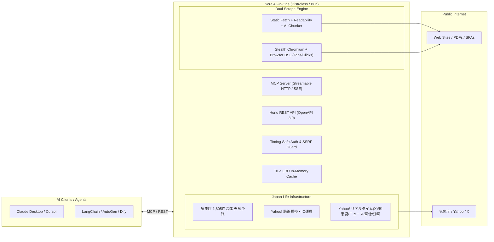

# Sora (空)

> **日本のWebをAIエージェントから利用するための Self-hosted MCP / REST 統合サーバー**  
> *All-in-One, Zero-Middleware Web Scraping & Japanese Life Infrastructure Engine for AI Agents*

`Sora` は、LLM や AI エージェント（Claude Desktop, Cursor, Cline, OpenCodeInterpreter, Dify など）が **日本の Web 空間と日常インフラを自由かつ安全に探索・操作するための All-in-One MCP / REST サーバー** です。

外部 DB（Redis / PostgreSQL）やメッセージキューを一切必要とせず、**ヘッドレス Chromium と日本語 CJK フォントを内包した単一コンテナ** だけで月800円の VPS から即座に稼働します。



---

## ⚡ 5秒で繋がる Quickstart

Sora は **MCP (Model Context Protocol)** サーバーとして動作し、Docker / Podman コンテナで起動して AI エージェントから接続します。

### ① Docker / Podman での起動
```bash
docker run -d -p 3016:8000 --name sora ghcr.io/ikenokazuki/sora:latest
```

### ② MCP 接続 (Claude Desktop / Cursor / Cline / Antigravity)
AI エージェントの設定ファイル（`claude_desktop_config.json` 等）に以下を追加するだけで接続できます。
Sora は **Anthropic 推奨の Tool Search Tool (`defer_loading`)** 仕様に準拠しており、初期状態では 4 つのコアツールのみを露出し、残りの 31 ツールは `search_tools` により動的にオンデマンド有効化されるため、ツール定義によるコンテキスト消費を最小限に抑えられます。

```json
{
  "mcpServers": {
    "sora": {
      "url": "http://localhost:3016/mcp"
    }
  }
}
```

### ③ ChatGPT (Custom GPTs / Actions & Desktop MCP) での利用
- **Custom GPTs (Actions / OpenAI)**:
  1. ChatGPT の GPT Builder で「Configure」→「Actions」→「Create new action」を選択。
  2. 「Import from URL」に `http://<your-host>:3016/openapi.json` を指定すると、全 35 エンドポイントが自動登録され、ChatGPT から日本の Web 検索・スクレイピング・天気・知恵袋・X速報等を呼び出せます。
- **ChatGPT Desktop (MCP)**:
  `http://localhost:3016/mcp` を MCP サーバーとして指定。

---
## Soraの由来
Soraはアイドルグループ「[君と見るそら](https://x.com/kimisora_jpn)」から引用しました。
「そら」は夜空に晴天に雨上がりに夕焼けにカラッとした夏空などいろんな「表情」があります。
リアルタイム情報や知の蓄積であるWEBもある意味で「表情」。
それをAIに「伝えて」リアルタイムで反映するという想いを込めてます。
cloud（雲）も空にあり空は世界中繋がってます。
ネット上の情報を一つのツールで「繋げる」という意味もあります。

---

## 🌟 主な特徴と強み (Why Sora?)

1. **🗾 日本の日常インフラ & Web 探索の完全網羅**:
   - 海外製ツール（Firecrawl / Tavily）では対応できない「Yahoo! 知恵袋」「X (Twitter) リアルタイム速報」「気象庁公式オープンデータ直結（全国 1,805 市区町村自動選定）」「電車乗換案内」を単一 MCP で提供。
2. **⚡ 圧倒的なミリ秒応答 & 超低消費メモリ**:
   - Bun 最適化ランタイムにより、API 応答 **1.5ms**、常駐メモリ **JSヒープ ~32MB / 全体 ~140MB**。AI エージェントの待ち時間を極限まで短縮。
3. **📦 完全オールインワン & ゼロミドルウェア**:
   - Redis、PostgreSQL、外部ワーカーキュー等は一切不要。単一コンテナだけで即座に完結。
4. **🛡️ Distroless（シェルなし）& 厳格なセキュリティ**:
   - ベースイメージに `gcr.io/distroless/cc-debian12` を採用。コンテナ内に `/bin/sh`, `bash`, `curl` 等が存在せず、RCE（任意コード実行）攻撃を無力化。
   - SSRF / DNS Rebinding 遮断、定数時間比較による Timing Attack 防止、ブラウザセッション所有権分離、DoS 防御（Body Limit 10MB）を標準装備。
5. **🕹️ ステートフルなブラウザ操作 DSL**:
   - `open` → `fill` → `click` → `screenshot` → `evaluate` の複数ターン対話型ブラウザセッションを API / MCP から直接制御。

---

### 📊 パフォーマンス & アーキテクチャ比較

| 項目 | Sora (本ツール) | Firecrawl (セルフホスト) | 一般的な Node/Python 製 MCP |
|---|---|---|---|
| **API / ヘルスチェック応答** | **1.5 ms** (`0.0015s`) | 20〜50 ms | 30〜100 ms |
| **起動時間 (コールドスタート)** | **< 10 ms** | 10〜30 秒 (複数サービス) | 1〜3 秒 |
| **常駐メモリ消費 (RSS)** | **約 140 MB** (JSヒープ ~32MB) | 2GB〜4GB+ | 250MB〜800MB |
| **イメージサイズ (Total)** | **約 1.29 GB** (Bun+Chromium+日本語フォント内包) | 4GB〜6GB+ (複数イメージ合計) | 800MB〜2.5GB |
| **必要なコンテナ構成** | **単一コンテナ (All-in-One)** | 5〜6 個 (Redis/PG/Workers) | 複数 MCP プロセスが乱立 |
| **セキュリティ設計** | **Distroless (シェルなし・非root)** | 通常 Debian/Alpine | 通常 Debian/Ubuntu |
| **日本のローカル情報** | **完全対応 (天気・乗換・知恵袋・X)** | 非対応 (Webのみ) | プラグイン個別導入が必要 |

---

### ⏱️ 各エンドポイントの実測応答速度 (Measured Latency: Cold vs Cached)

実機ローカルサーバーにおける「初回取得（非キャッシュ時）」と「キャッシュヒット時」の実測レイテンシ一覧です。AI エージェントが思考・生成する時間（1〜3秒）と比較して圧倒的に高速に応答します。

| エンドポイント | 初回取得 (非キャッシュ時) | キャッシュ時 (2回目以降) | 処理内容・技術特徴 |
|---|:---:|:---:|---|
| `GET /health` | **0.2 〜 1.8 ms** | — | API 死活監視・ヘルスチェック（Bun 最適化） |
| `GET /weather` (気象庁天気) | **約 38 ms** | **0.4 〜 0.7 ms** | 気象庁公式 CDN（`jma.go.jp`）直結パース＋1,805自治体自動選定 |
| `POST /scrape` (静的最速モード) | **約 79 ms** | **0.5 〜 1.0 ms** | Web ページの高速フェッチ＋Markdown 本文抽出 |
| `POST /scrape` (SPA自動昇格 / ブラウザ描画) | **約 1.2 〜 1.6 秒** | **0.5 〜 1.0 ms** | 静的取得で空白/Bot画面検知時に自動でStealth Chromiumへ昇格してMarkdown抽出 |
| `POST /transit/route` (乗換案内) | **約 390 ms** | **0.6 〜 7.0 ms** | Yahoo! 路線情報スクレイプ（最適経路・IC運賃計算） |
| `POST /search/realtime` (X速報) | **約 440 ms** | **0.6 ms** | Yahoo! リアルタイム検索（Xツイート＆画像抽出） |
| `POST /search/news` (ニュース) | **約 480 ms** | **0.6 ms** | Yahoo! ニュース最新記事検索 |
| `POST /search/image` / `video` | **450 〜 550 ms** | **0.6 ms** | Yahoo! 画像・動画検索 |
| `POST /search/chiebukuro` (知恵袋) | **420 〜 500 ms** | **0.6 ms** | Yahoo! 知恵袋 Q&A 検索 |
| `POST /search/suggest` (サジェスト) | **約 820 ms** | **0.5 ms** | Yahoo! オートコンプリート関連語補完 |
| `POST /browser/action` (初回実行) | **約 1.4 秒** | — | Stealth Chromium 起動＋描画＋クリック＋待機＋スクショ＋Markdown 抽出 |
| `POST /browser/action` (セッション継続) | **約 0.5 〜 0.8 秒** | — | 既存タブ（`sessionId`）上での追加アクション実行 |

#### ⚡ 内部エンリッチメント・AI最適化処理の実測速度 (In-Memory Latency)

外部 LLM API を介さず、すべて Bun ネイティブおよび最適化アルゴリズムにより **1ミリ秒未満（< 1ms）** で完結します。

| 処理・機能 | 処理時間 (1回あたり実測値) | 特徴・アルゴリズム |
|---|:---:|---|
| **読了時間・文字統計計算** (`calculateContentStats`) | **0.03 ms** (`31 µs`) | CJK/英単語の高速カウント＆推定読了時間算出 |
| **出典・引用リンク抽出** (`extractCitationsFromMarkdown`) | **0.06 ms** (`62 µs`) | 正規表現＋文脈コンテキストスライシング |
| **RAG セマンティック・チャンキング** (`chunkMarkdownContent`) | **0.13 ms** (`138 µs`) | 見出し・コードブロック境界を考慮したセマンティック分割 |
| **検索結果の重複・類似排除** (`dedupSearchResults`) | **0.33 ms** (`335 µs`) | 50件の N-gram Jaccard 類似度判定 |
| **PII 個人情報自動マスキング** (`maskPiiInText`) | **0.55 ms** (`557 µs`) | メール・電話・Luhn クレジットカード判定＆置換 |
| **超高速 抽出型自動要約 (TL;DR)** (`generateExtractiveSummary`) | **0.97 ms** (`970 µs`) | TF-IDF 類似の重要文抽出アルゴリズム |
| **検索語句 Markdown 強調ハイライト** (`highlightMatches`) | **9.1 ms** | 正規表現による構文安全な `<mark>` タグ挿入 |

---

## 🏛️ 設計思想 (Design Philosophy & Principles)

`Sora` は、以下の **4つのコア設計原則** に基づいて構築されています：

1. **✂️ オッカムの剃刀（Occam's Razor & Zero-Middleware）**:
   - *「必要が無いなら多くのものを定立してはならない。要件を満たす最も単純な構成が最良の構成である。」*
   - Redis、PostgreSQL、外部キュー、重厚なマイクロサービス群を一切排除。**「単一コンテナ（All-in-One）」** だけで動作し、月800円の VPS や Raspberry Pi から数万リクエストのクラウドまで壊れずに常駐します。
2. **🛡️ ステルスと生還率のパレート最適（Stealth & Pareto Optimum）**:
   - 単に「0ms で機械的アクセス」をすれば、相手先サーバーの WAF や Cloudflare に即座に IP を BAN され、成功率は 0% に堕ちます。
   - 同一ドメインへの連続アクセス時に **150ms + Jitter（0〜100ms ゆらぎ）** を自動挿入し、タイピングにも **15〜40ms の人間的遅延** を付与。AI から見た体感速度を損なわずに **確実にデータを持ち帰る生還率** を最優先しています。
3. **🔒 ディストロレスによる堅牢なセキュリティ（Distroless by Design）**:
   - コンテナ内に `/bin/sh`, `bash`, `curl`, `apt` が存在しないため、万が一未知の脆弱性があっても攻撃者がシェルを奪取する余地（RCE: 任意コード実行）が原理的にありません。非 root 実行および厳格な SSRF 遮断を標準装備。
4. **🗾 公的オープンデータ直結・持続可能性（Sustainable & Autonomous）**:
   - 天気予報は気象庁公式オープンデータ CDN（`jma.go.jp`）へ直接アクセス。全国 1,805 市区町村名のゼロミリ秒自動解決と 30 分 LRU キャッシュにより、相手先サーバーへの負荷を最小限に抑えながら永久に自律稼働します。

---

## 1. クイックスタート

### 1.1 コンテナの起動 (Docker / Podman)

GitHub Container Registry (GHCR) から 1 コマンドで即座に起動できます:

```bash
docker run -d \
  --name sora \
  -p 3016:8000 \
  -e API_KEY="your-secret-api-key" \
  -e ENABLED_MODULES="all" \
  ghcr.io/ikenokazuki/sora:latest
```

### 1.2 MCP クライアント設定（Claude Desktop / Cursor / Cline / Windsurf 等）

#### Streamable HTTP 接続（推奨・標準）
設定ファイル（例: `claude_desktop_config.json` や Cursor の MCP 設定）に以下を追加します:

```json
{
  "mcpServers": {
    "sora": {
      "url": "http://localhost:3016/mcp",
      "headers": {
        "Authorization": "Bearer your-secret-api-key"
      }
    }
  }
}
```

#### SSE 接続（レガシー SSE クライアント向け）
```json
{
  "mcpServers": {
    "sora": {
      "url": "http://localhost:3016/sse",
      "headers": {
        "Authorization": "Bearer your-secret-api-key"
      }
    }
  }
}
```
*(※ API キーが未設定の場合は `headers` を省略可能です)*

---

## 2. 提供 MCP ツール一覧 (全 35 ツール / 9つのモジュール & 動的ツール発見)

Sora は、目的に応じて **9つの論理モジュール（全 35 ツール）** で構成されています。環境変数 `ENABLED_MODULES`（デフォルト: `all`、または `web,browser,yahoo,life,disaster,watch,music,gov,trade`）で有効化するカテゴリを自由にカスタマイズ可能です。

### 🔍 動的ツール発見 (Tool Search Tool: `search_tools`)
Anthropic の公式ベストプラクティス（`defer_loading: true` 推奨）に基づき、AI エージェントのコンテキスト肥大化（35 ツールのスキーマだけで 12,000〜25,000 トークン消費）を防ぐため、**初期露出は 4 つのコアツールのみ** に厳選されています。

- **初期有効 (★ CORE 4ツール)**: `scrape`, `search_web`, `search_deep`, `search_tools`
- **動的有効化 (・ DEFERRED 30ツール)**: フライト・標高/ジオコード・国会会議録・天気・乗換・知恵袋・X速報・画像・ニュース・音楽・法令・交通情報・差分監視・米国貿易コンプライアンス（CPSC/FDA/HTSコード検証）など

エージェントが `search_tools({ query: "知恵袋" })` や `search_tools({ query: "天気" })`、`search_tools({ query: "フライト" })`、`search_tools({ query: "国会" })` を呼び出すと、該当ツールが**同一セッション内で即座に自動有効化**され、次回の `tools/list` および `tools/call` で利用可能になります。

```
┌───────────────────────────────────────────────────────────────────────────────────────────────────────────────────────┐
│                                                  Sora - Modular MCP                                                   │
├─────────────────┬───────────────────┬──────────────────┬─────────────────┬─────────────┬───────────────┬──────────────┤
│ 🌐 Core Web     │ 🤖 Browser Action │ 🇯🇵 Yahoo Services │ 🗾 Daily Life   │ 🚨 Disaster │ 👁️ Watch/Diff │ 🏛️ Gov / Law │
│ (`web`)         │ (`browser`)       │ (`yahoo`)        │ (`life`)        │(`disaster`) │ (`watch`)     │ (`gov`)      │
│ ★scrape         │ ・browser_action  │ ・search_image   │ ・search_route  │・search_    │・watch_       │・search_laws │
│ ★search_web     │   (クリック/入力/ │ ・search_video   │   (乗換案内)    │  disaster_  │  register     │・get_law_text│
│ ★search_deep    │    スクショ/JS実行│ ・search_news    │ ・get_weather   │  warnings   │・watch_check  │・search_diet_│
│ ★search_tools   │    セッション保持)│ ・search_chiebukuro│ (気象庁天気)  │・search_    │・watch_list   │  minutes     │
│ ・scrape_batch  │                   │ ・search_realtime│ ・search_road_  │  earthquake ├───────────────┤ (国会会議録) │
│ ・map_site      │                   │ ・search_trend   │   traffic (道路)│・get_       │ 🎵 Music      ├──────────────┤
│ ・crawl_site    │                   │ ・suggest_keywords│・get_flight_    │  elevation  │ (`music`)     │              │
│                 │                   │                  │   status (航空) │ (国土地理院)│・search_song  │              │
│                 │                   │                  │                 │             │・search_artist│              │
│                 │                   │                  │                 │             │・search_music │              │
└─────────────────┴───────────────────┴──────────────────┴─────────────────┴─────────────┴───────────────┴──────────────┘
★ = 初期常時有効 (CORE: 4ツール) / ・ = search_tools により動的オンデマンド有効化 (DEFERRED: 31ツール)

🚢 Trade Compliance (`trade`) モジュールは図には未収録（詳細は Module 9 参照）:
・check_cpsc_certificate（米国CPSC適合証明書eFiling判定）・check_fda_regulated（米国FDA規制対象簡易判定）・verify_hts_code（HTS/HSコード実在確認・検証）
```

### 🌐 Module 1: Core Web & Crawling (`ENABLED_MODULES=web`)
Web 検索と本文スクレイピング、一括並行取得、深層統合検索、動的ツール発見、サイトマップ解析、再帰クロール。

| ツール名 | 状態 | 説明 | 識別プロパティ | 主要引数 |
|---|:---:|---|---|---|
| `scrape` | **★ CORE** | 指定 URL の Web ページまたは PDF をスクレイピングし、本文を Markdown 形式で抽出します。SPA サイト（TimeTree や React/Next.js 等の非同期フェッチ型含む）のローディング自動待機・カレンダー/テーブル構造化抽出や Bot 対策画面の自動 Chromium 昇格に対応。RAGチャンキング・出典抽出・読了時間・PII保護・テーブルJSON抽出・要約生成を完備。 | `source: "web"` | - `url` (string, 必須): 対象 URL / PDF<br>- `maxChars` (number, 任意): 最大文字数 (デフォルト: 10000)<br>- `mode` (string, 任意): `"auto"` (デフォルト), `"fast"`, `"browser"`<br>- `formats` (string[], 任意): `["markdown", "html", "rawHtml", "links", "screenshot", "jsonLd", "images", "tables"]`<br>- `waitAfterLoadedMs` (number, 任意): 描画後の追加待機時間(ms)<br>- `formatAsPrompt` (boolean, 任意): LLM用標準XMLラッパー形式を生成するか |
| `search_web` | **★ CORE** | Web 検索を実行し、検索上位のタイトル・概要スニペット・URL を取得します。ドメイン絞り込み・除外・期間指定に対応。 | `source: "web"` | - `query` (string, 必須): 検索キーワード<br>- `includeDomains` (string[], 任意): 絞り込むドメイン<br>- `excludeDomains` (string[], 任意): 除外するドメイン<br>- `updated` (string, 任意): 期間指定 (`"all"`, `"day"`, `"week"`, `"year"`) |
| `search_deep` | **★ CORE** | Firecrawl / Tavily 互換の統合深層検索。Web検索＋上位サイト本文自動スクレイプ＋リアルタイム検索を一度にまとめて取得します。 | Web: `source: "web"`<br>X: `source: "x"` | - `query` (string, 必須): 検索キーワード<br>- `limit` (number, 任意): 本文取得件数 (デフォルト: 5, 最大: 20)<br>- `scrapeContent` (boolean, 任意): 本文を含めるか (デフォルト: true)<br>- `includeRealtime` (boolean, 任意): リアルタイム検索も含めるか (デフォルト: true)<br>- `formats` (string[], 任意) |
| `search_tools` | **★ CORE** | **【動的ツール発見メタツール】** Sora の全専門ツール（天気・乗換・知恵袋・X速報・音楽・法令・交通情報・差分監視等）をキーワード検索し、現在の MCP セッション内で即座に有効化します。 | - | - `query` (string, 必須): 検索キーワードまたはカテゴリ名 (例: `"天気"`, `"知恵袋"`, `"yahoo"`, `"music"`, `"交通"`, `"法令"`) |
| `scrape_batch` | ・ DEFERRED | 複数の Web ページ URL を指定し、ドメインスロットリングを維持しながら高速に並行スクレイピングして一括返却します。 | `source: "web"` | - `urls` (string[], 必須): スクレイピング対象 URL 配列 (最大20件)<br>- `concurrency` (number, 任意): 並行ワーカー数 (デフォルト: 3, 最大: 5) |
| `map_site` | ・ DEFERRED | 指定した Web サイトの sitemap.xml や内部リンクを探索し、サイト内の全 URL 一覧（サイトマップ）を高速抽出します。 | - | - `url` (string, 必須): 対象のベース URL<br>- `limit` (number, 任意): 取得件数 (デフォルト: 200, 最大: 1000) |
| `crawl_site` | ・ DEFERRED | 指定した URL 配下のページを再帰的にクロールし、複数ページの本文を一括収集します。 | `source: "web"` | - `url` (string, 必須): クロール開始 URL<br>- `maxPages` (number, 任意): 最大取得ページ数 (デフォルト: 10, 最大: 50)<br>- `maxDepth` (number, 任意): 最大リンク深度 (デフォルト: 2) |
---

### 💡 LLM / Agent 連携時のベストプラクティス & `limit` 調整ガイド

エージェントや RAG アプリケーションで Web 検索・スクレイピング・クロールを活用する際、取得件数（`limit`）の設定によってレイテンシや回答品質が大きく変化します。

#### 1. 取得件数を増やすメリット・デメリット

| 項目 | メリット | デメリット・リスク | 推奨設定 |
| :--- | :--- | :--- | :--- |
| **統合深層検索 (`/search`)** | より幅広いソースから情報を網羅できる。 | ・**レイテンシ増大**: 10〜20 サイトを並行取得すると応答時間が 5〜15 秒に遅延。<br>・**LLM コンテキスト肥大化**: 大量の全文を渡すとトークン消費が増大し、重要情報が埋もれる（*Lost in the Middle* 現象）。 | デフォルト `5`<br>(最大 `20`) |
| **サイト内クロール (`/crawl`)** | ドキュメント全体の網羅的なナレッジ収集が可能。 | ・**時間・リソース消費**: ページ数に比例して処理時間が増大。 | デフォルト `10`<br>(最大 `50`) |
| **サイトマップ探索 (`/map`)** | サイト全体の構造を瞬時に把握可能。 | ・テキスト処理のみのため負荷は極めて小さい。 | デフォルト `200`<br>(最大 `1000`) |

#### 2. 最も高精度な LLM 活用のベストプラクティス
> [!TIP]
> **より効果的なアプローチ**:
> 1. **スニペットと全文の使い分け**: 検索スニペット（`search_web`）自体は **10〜20 件** 返して概要を広く把握しつつ、全文スクレイプ対象（`search_deep` の `limit`）は **上位 3〜5 件に絞る** のが最も高速かつ高精度です。
> 2. **Google 流 非AI最先端ハイライト＆スニペット抽出**: `extractHighlights: true`（`query` 指定）を有効化すると、**Fielded BM25F + BM25+ エンジン**（見出し階層継承・句読点文境界スナッピング・語順整合マトリクス・Information Gain新規性選択・最短包含区間近接度）により、LLM は長いページ全体を読む代わりに**クエリに関連する最も重要な段落・センテンスのみを集中して読める**ため、ハルシネーションを防止しつつトークン消費を 70〜90% 削減できます。さらに W3C 標準の `textFragmentUrl`（`#:~:text=...`）が自動生成され、ブラウザや `browser_action` が該当位置へ即座に自動スクロール・反転表示します（完全インメモリ、0.2ms で高速動作）。
> 3. **Google 流 説明文自動選定器 (Meta vs Body Dynamic Arbiter)**: サイト共通の固定定型文（ボイラープレート）を自動検知し、クエリ直結の動的スニペットを `description` に自動昇格。検索結果一覧（SERP）の段階で AI が 100% 正確に内容を把握できます。
> 4. **全エンドポイント共通メタデータ (Firecrawl / Tavily 互換)**: `publishedTime`（公開日時/更新日時）、`author`（著者名）、`siteName`（サイト名）を OGP / JSON-LD / HTML メタタグから自動抽出し、Frontmatter および JSON レスポンスに付与。LLM が情報の鮮度（ファクトチェック）を瞬時に判定可能。
> 5. **GFM シンタックスハイライト言語の保持**: `<pre><code class="language-python">` 等からプログラミング言語名を正確に識別し、Markdown 出力時に ` ```python ` として再現。
> 6. **自動トークン圧縮 & ノイズ除去**: 空リンク、無効な JavaScript リンク、不要な重複空行を自動クレンジング（`cleanMarkdownTokens`）し、Cookie 同意バナー（OneTrust / Cookiebot 等）も完全パージするため、LLM コンテキストを常にクリーンに保ちます。
> 7. **robots.txt サイトマップ自動発見**: `/robots.txt` から変則配置された Sitemap URL を自動検出し、Sitemap Index を最大 1,000 件まで再帰走査。
> 8. **クロール時のストリーミング**: 多数のページを巡回する際は、`POST /crawl/stream`（SSE）を利用して 1 ページ取得完了ごとに逐次受信・処理することで、全体の完了を待たずに即座にユーザーや LLM へ中間応答を返せます。


#### 3. 実測ベンチマークとスケーラビリティ特性 (ローカル実測値)

| 処理 | 件数・ページ数 | 平均レイテンシ (ms) | スループット | 特性・備考 |
| :--- | :--- | :--- | :--- | :--- |
| **サイト内クロール** (`/crawl`) | `maxPages: 5` (旧デフォルト) | **358 ms** | 13.9 pages/sec | 3並行フェッチにより極めて高速 |
| | `maxPages: 10` (**新デフォルト**) | **341 ms** | **29.3 pages/sec** | 並行キューの効率化で旧デフォルトと同等の所要時間 |
| | `maxPages: 20` | **2,046 ms** | 9.8 pages/sec | 20ページの全文収集を約2秒で完了 |
| | `maxPages: 50` (**新上限**) | **4,685 ms** | 10.7 pages/sec | 50ページ巡回も 5秒未満で安定動作 |
| **サイトマップ探索** (`/map`) | `limit: 100` (旧デフォルト) | **826 ms** | - | XML/HTML パースのみで極めて軽量 |
| | `limit: 200` (**新デフォルト**) | **882 ms** | - | 100件時とほぼ変わらない応答速度 (+56ms) |
| | `limit: 1000` (**新上限**) | **808 ms** | - | 1,000件探索でもオーバーヘッドほぼゼロ |
| **統合深層検索** (`/search`) | `limit: 3` (旧デフォルト) | **約 1.4 秒** | - | Web検索 + 上位3件並行スクレイプ |
| | `limit: 5` (**新デフォルト**) | **約 2.0 〜 3.4 秒** | - | Web検索 + 上位5件並行スクレイプ |
| | `limit: 20` (**新上限**) | **約 4 〜 8 秒** | - | 幅広いソースのディープ調査用 |

---

### 🤖 Module 2: Browser Actions & Automation (`ENABLED_MODULES=browser`)
フォーム入力、ボタンクリック、画面スクロール、JavaScript 実行、スクリーンショット撮影、マルチターン対話セッション。

| ツール名 | 説明 | 識別プロパティ | 主要引数 |
|---|---|---|---|
| `browser_action` | Web ページを開き、指定された一連のアクションシーケンス（クリック・文字入力・キー押下・スクロール・待機・スクショ・JS実行・ページ遷移）を実行して最終画面の Markdown や Base64 スクリーンショットを返却。ボタンの「表示テキスト指定クリック」や `sessionId` によるマルチターン対話セッション維持に対応。 | `source: "browser"` | - `url` (string, 任意): 開始/遷移 URL<br>- `sessionId` (string, 任意): 既存セッションID<br>- `createSession` (boolean, 任意): セッションを作成・維持するか<br>- `closeSession` (boolean, 任意): セッションを終了するか<br>- `actions` (array, 任意): 実行アクション一覧 (`click`, `fill`, `press`, `select`, `scroll`, `wait`, `evaluate`, `navigate`)<br>- `extract` (object, 任意): `{ markdown: true, screenshot: true, html: false }`<br>- `timeout` (number, 任意): タイムアウト ms |

---

### 🇯🇵 Module 3: Yahoo! JAPAN Services (`ENABLED_MODULES=yahoo`)
日本のメディア・Q&A・トレンド・リアルタイム情報に完全特化した検索群。

| ツール名 | 説明 | 識別プロパティ | 主要引数 |
|---|---|---|---|
| `search_image` | Yahoo! JAPAN 画像検索を実行し、画像タイトル・画像URL・サムネイル・画像サイズ・ソース元ページを取得します。 | 各アイテムに `source: "image"` | - `query` (string, 必須): 検索キーワード<br>- `limit` (number, 任意): 取得件数 (デフォルト: 20, 最大: 50) |
| `search_video` | Yahoo! JAPAN 動画検索を実行し、動画タイトル・動画URL・再生時間・配信元・サムネイルを取得します。 | 各アイテムに `source: "video"` | - `query` (string, 必須): 検索キーワード<br>- `limit` (number, 任意): 取得件数 (デフォルト: 20, 最大: 50) |
| `search_news` | Yahoo!ニュース検索を実行し、最新ニュース記事のタイトル・概要・配信社・公開日時・記事URLを取得します。 | 各アイテムに `source: "news"` | - `query` (string, 必須): 検索キーワード<br>- `limit` (number, 任意): 取得件数 (デフォルト: 10, 最大: 50) |
| `search_chiebukuro` | Yahoo!知恵袋 Q&A 検索を実行し、質問タイトル・回答数・解決ステータス・本文スニペットを取得します。 | 各アイテムに `source: "chiebukuro"` | - `query` (string, 必須): 検索キーワード<br>- `limit` (number, 任意): 取得件数 (デフォルト: 10, 最大: 50) |
| `suggest_keywords` | Yahoo! JAPAN オートコンプリートサジェストを取得し、関連検索ワード・補完候補を返します。 | `source: "suggest"` | - `query` (string, 必須): 補完キーワード<br>- `limit` (number, 任意): 取得件数 (デフォルト: 10, 最大: 30) |
| `search_realtime` | Yahoo! リアルタイム検索を実行し、X (旧 Twitter) の最新ポスト（投稿者・本文・投稿日時・メディア・URL）を取得します。新着順 (`recent`) と 話題順 (`popular`) の切り替えに対応。 | 各アイテムに `source: "x"` | - `query` (string, 必須): 検索キーワード<br>- `sort` (string, 任意): `"recent"` (新着順, デフォルト) または `"popular"` (話題順)<br>- `limit` (number, 任意): 取得件数 (デフォルト: 20, 最大: 40)<br>- `page` (number, 任意): ページ番号 (デフォルト: 1) |
| `search_trend` | Yahoo リアルタイム検索の最新トレンド（急上昇キーワードランキング 20 件）を取得します。 | 各アイテムに `source: "x"` | - `limit` (number, 任意): 取得件数 (デフォルト: 20) |

---

### 🗾 Module 4: Japan Daily Life & Transit (`ENABLED_MODULES=life`)
日本の公共交通・気象庁公式オープンデータに直結した生活インフラ機能。

| ツール名 | 説明 | 識別プロパティ | 主要引数 |
|---|---|---|---|
| `search_route` | 日本国内の電車乗換案内。駅間の最適ルート・所要時間・乗換回数・IC/きっぷ運賃を探索。経由駅指定（最大3駅）、日時指定、特急/新幹線利用フラグに対応。 | `source: "transit"` | - `from` (string, 必須): 出発駅名 (例「東京」)<br>- `to` (string, 必須): 到着駅名 (例「新宿」)<br>- `via` (string[], 任意): 経由駅 (最大3駅)<br>- `timeType` (string, 任意): `"departure"`, `"arrival"`, `"first_train"`, `"last_train"`<br>- `ticket` (string, 任意): `"ic"`, `"cash"`<br>- `sortBy` (string, 任意): `"time"`, `"transfer"`, `"fare"` |
| `get_weather` | 気象庁公式オープンデータ直結による日本全国各地の今日・明日・明後日の天気予報、予想気温、降水確率、天気概況、風・波情報を取得。全国 1,805 市区町村名の自動解決に対応。 | `source: "weather"` | - `city` (string, 必須): 市区町村名 (例「天童市」「軽井沢」「箱根」「浦安」「東京」) または 地点ID (例「130010」)<br>- `days` (number, 任意): 予報日数 (1〜3日, デフォルト: 3) |
| `search_road_traffic` | JARTIC 連携データによる日本全国の高速道路・都市高速・主要有料道路のリアルタイム道路交通情報（事故・渋滞・通行止め・車線規制・工事等）を取得。都道府県・主要高速道路の区間別詳細に対応。 | `source: "jartic"` | - `pref` (string, 任意): 都道府県名またはコード (例「東京都」「愛知県」「大阪府」「13」)<br>- `road` (string, 任意): 道路名 (例「東名高速」「首都高」「中央道」「名神高速」) |
| `get_flight_status` | 主要空港（羽田・成田・伊丹・関空・中部・新千歳・福岡・那覇等）の国内線・国際線フライトのリアルタイム運航状況、定刻、変更時刻、便名、行先、欠航・遅延ステータスおよび理由詳細を取得。 | `source: "yahoo-transit"` | - `airport` (string, 任意): 空港名またはコード (例: "羽田", "成田", "HND", "NRT", デフォルト: "羽田")<br>- `type` (string, 任意): `"departure"`(出発) または `"arrival"`(到着)<br>- `category` (string, 任意): `"domestic"`(国内線) または `"international"`(国際線)<br>- `flightNumber` (string, 任意): 便名絞り込み (例: "ANA2421", "JAL505")<br>- `keyword` (string, 任意): 行先・航空会社名絞り込み |

---

### 🚨 Module 5: Disaster & Emergency (`ENABLED_MODULES=disaster`)
気象庁公式特別警報・気象警報・注意報および P2P地震情報 / 気象庁リアルタイム地震速報。

| ツール名 | 説明 | 識別プロパティ | 主要引数 |
|---|---|---|---|
| `search_disaster_warnings` | 気象庁公式防災情報による特別警報・気象警報・注意報（大雨、洪水、暴風、大雪、波浪、高潮、雷等）を市区町村・都道府県単位でリアルタイム取得します。 | `source: "disaster"` | - `city` (string, 任意): 市区町村名または都道府県名 (例: "東京", "新宿区", "大阪府", "福岡")<br>- `areaCode` (string, 任意): 気象庁エリアコード (6桁または2桁, 例: "130000", "130010") |
| `search_earthquake` | P2P地震情報および気象庁公式速報によるリアルタイム地震履歴（発生時刻、震源地、マグニチュード、深さ、最大震度、津波有無、各地の観測地点）を取得します。 | `source: "disaster"` | - `limit` (number, 任意): 取得件数 (1〜20, デフォルト: 5)<br>- `minIntensity` (number, 任意): 最小震度フィルター (10=震度1, 20=震度2, 30=震度3, 40=震度4, 45=震度5弱, 50=震度5強) |
| `get_elevation` | 国土地理院公式オープンデータに基づき、日本全国の住所・地名から緯度経度を自動特定し、海抜標高（m）をミリ精度で取得。津波・水害ハザードリスク判定に活用可能。 | `source: "gsi"` | - `address` (string, 任意): 住所・地名文字列 (例: "東京都千代田区永田町1-7-1", "富士山頂")<br>- `lat` (number, 任意): 緯度<br>- `lon` (number, 任意): 経度 |

---

### 👁️ Module 6: Watch & Diff Monitoring (`ENABLED_MODULES=watch`)
汎用 Web ページ監視プリミティブ。URL / セレクタごとの定期差分検知、SQLite 履歴永続化、自動 Webhook 通知。

| ツール名 | 説明 | 識別プロパティ | 主要引数 |
|---|---|---|---|
| `watch_register` | Web ページの変更監視ターゲットを登録し、初期ハッシュベースラインを構築します。チケット当落、再販監視、お知らせ検知等に利用可能。 | `source: "watch"` | - `url` (string, 必須): 監視対象の Web ページ URL<br>- `title` (string, 任意): 監視ターゲットの識別用タイトル<br>- `selector` (string, 任意): ピンポイントで監視する CSS セレクタ<br>- `webhookUrl` (string, 任意): 差分検知時に通知する Webhook URL<br>- `intervalSeconds` (number, 任意): 監視インターバル目安 (秒, デフォルト: 3600) |
| `watch_check` | 登録された監視ターゲットの差分スキャンを実行し、変化の有無・ハッシュ値・スナップショットを返します。差分検知時は自動で Webhook を発火します。 | `source: "watch"` | - `id` (string, 任意): 特定の監視ターゲット ID (省略時は全登録ターゲットを一括スキャン) |
| `watch_list` | 現在 SQLite に永続化されている監視ターゲットの一覧および最終チェック状態を取得します。 | `source: "watch"` | - なし |
| `watch_delete` | 指定したIDの監視ターゲットをSQLiteから削除し、以後の差分監視を停止します。 | `source: "watch"` | - `id` (string, 必須): 削除する監視ターゲットのID |

---

### 🎵 Module 7: Music Metadata (`ENABLED_MODULES=music`)
iTunes 公式 Search API と連携した楽曲・アルバム・アーティストのメタデータ検索（法的リスクゼロ）。

| ツール名 | 説明 | 識別プロパティ | 主要引数 |
|---|---|---|---|
| `search_song` | iTunes Search API による曲名（楽曲タイトル）指定の楽曲メタデータ検索を実行し、高解像度ジャケット画像（600x600）、30秒試聴音源 URL、アーティスト名、リリース日、Apple Music リンク等を取得します。 | `source: "music"` | - `query` (string, 必須): 検索曲名・タイトル (例: "アイドル", "夜に駆ける")<br>- `country` (string, 任意): 国コード (デフォルト: "jp")<br>- `limit` (number, 任意): 取得件数 (1〜50, デフォルト: 20) |
| `search_artist` | iTunes Search API によるアーティスト名指定の音楽メタデータ検索を実行し、アーティスト代表曲一覧、アルバム一覧、アーティスト基本情報を取得します。 | `source: "music"` | - `query` (string, 必須): アーティスト名 (例: "YOASOBI", "Official髭男dism")<br>- `country` (string, 任意): 国コード (デフォルト: "jp")<br>- `entity` (string, 任意): "song" (楽曲一覧), "album" (アルバム一覧), "musicArtist" (アーティスト情報) (デフォルト: "song")<br>- `limit` (number, 任意): 取得件数 (1〜50, デフォルト: 20) |
| `search_music` | iTunes Search API による楽曲・アルバム・アーティストメタデータ検索を実行します（汎用・後方互換用）。 | `source: "music"` | - `query` (string, 必須): 検索キーワード (曲名、アーティスト名、アルバム名)<br>- `country` (string, 任意): 国コード (デフォルト: "jp")<br>- `entity` (string, 任意): "song", "album", "musicArtist" (デフォルト: "song")<br>- `attribute` (string, 任意): "songTerm", "artistTerm", "albumTerm"<br>- `limit` (number, 任意): 取得件数 (1〜50, デフォルト: 20) |

---

### 🏛️ Module 8: Government & Law Data (`ENABLED_MODULES=gov`)
デジタル庁・総務省公式 e-Gov 法令 API v2 および 国立国会図書館公式 API と連携した日本の法令条文検索・国会審議発言録全文検索（完全無料・登録不要）。

| ツール名 | 説明 | 識別プロパティ | 主要引数 |
|---|---|---|---|
| `search_laws` | e-Gov 法令 API v2 によるキーワード法令検索を実行し、法令名、法令番号、公布年月日、法令種別の一覧を取得します。BM25+ 多信号リランキングにより完全一致法令を最上位表示。 | `source: "e-gov"` | - `keyword` (string, 必須): 検索キーワード (例: "著作権法", "民法")<br>- `limit` (number, 任意): 取得件数 (1〜50, デフォルト: 20) |
| `get_law_text` | e-Gov 法令 API v2 による法令条文・本文詳細取得を実行し、章・節・条・項・号が正確に構造化された Markdown 形式で返却します。 | `source: "e-gov"` | - `lawId` (string, 必須): e-Gov 法令ID (例: "129AC0000000089") |
| `search_diet_minutes` | 国立国会図書館公式 API による戦後〜最新（2026年）の衆議院・参議院本会議および全委員会の発言記録・議員答弁全文検索。立法趣旨・政治政策ファクトチェックに活用可能。 | `source: "kokkai-ndl"` | - `keyword` (string, 任意): 検索キーワード<br>- `speaker` (string, 任意): 発言者名 (例: "総理大臣")<br>- `nameOfHouse` (string, 任意): `"衆議院"` または `"参議院"`<br>- `nameOfMeeting` (string, 任意): 委員会名<br>- `from` / `until` (string, 任意): 期間 (YYYY-MM-DD)<br>- `limit` (number, 任意): 取得件数 (1〜30, デフォルト: 10) |

---

### 🚢 Module 9: Trade Compliance (`ENABLED_MODULES=trade`)
米国向け輸出入コンプライアンス判定（CPSC適合証明書eFiling義務化判定、FDA規制対象簡易判定、HTS/HSコード実在確認）。いずれも参考情報であり法的助言ではありません。

| ツール名 | 説明 | 識別プロパティ | 主要引数 |
|---|---|---|---|
| `check_cpsc_certificate` | HTSコードと製品情報から、米国CPSC（消費者製品安全委員会）管轄品目の適合証明書（GCC/CCC）発行要否・CBPへの電子申告（eFiling）義務有無を判定します。CPSC公式HTSリスト（2026年1月版、約600コード）との完全一致・6桁近似一致の段階マッチング。 | `source: "cpsc-hts-list"` | - `htsCode` (string, 必須): HTSコード (例: "9503.00.0073")<br>- `targetAge` (string, 必須): `"adult"` \| `"child"` \| `"unknown"`<br>- `material` (string, 任意): 主な素材<br>- `productCategory` (string, 任意): 製品カテゴリ補足<br>- `description` (string, 任意): 自由記述補足 |
| `check_fda_regulated` | HTSコードから、米国FDA（食品医薬品局）管轄の可能性をHS Chapter単位で判定します。HTS×FDフラグの機械可読な公式対応表が存在しないため、HS分類の一般知識に基づく粗い目安（`confidence: "chapter-level-estimate"`）です。 | `source: "hts-chapter-estimate"` | - `htsCode` (string, 必須): HTSコード (例: "3004.90.0000")<br>- `productDescription` (string, 任意): 製品の自由記述説明 |
| `verify_hts_code` | LLM・利用者が製品の素材・用途・機能から推論したHTSコード候補を、米国USITC公式データ (hts.usitc.gov) と照合し実在確認・正式説明・関税率を取得します。キーワード検索による一意特定は不可能と判明したため、逆に候補コードを検証する設計です。完全一致しない場合は6桁分類の近い候補（`nearbyCandidates`）を返します。 | `source: "usitc-hts"` | - `htsCode` (string, 必須): 検証したいHTSコード (例: "9503.00.0073")<br>- `productDescription` (string, 必須): 製品の説明（素材・用途・機能・加工度合い等）。コード推論の根拠を明示するため必須 |

---

---

## 3. REST API 仕様

ベース URL: `http://localhost:3016` (またはデプロイ先のドメイン URL)

> **📖 対話型 API ドキュメント & OpenAPI 仕様書**:
> - **Scalar API Reference (推奨・モダンUI)**: [`http://localhost:3016/docs`](http://localhost:3016/docs) (ダークモード・パラメータ型・制約・実行テスト対応)
> - **Swagger UI (互換用)**: [`http://localhost:3016/swagger`](http://localhost:3016/swagger)
> - **OpenAPI 3.0 仕様書 (JSON)**: [`http://localhost:3016/openapi.json`](http://localhost:3016/openapi.json)

### 3.1 ヘルスチェック & メトリクス
#### `GET /health`
```json
{
  "status": "ok",
  "service": "sora",
  "cachedEntries": 0,
  "chromiumAvailable": true,
  "yahooMcpAvailable": true,
  "mcpConnected": true,
  "timestamp": "2026-08-21T05:54:26.782Z"
}
```

#### `GET /health?detailed=true` (外部依存関係並行ヘルスチェック & アラート)
SQLite, Chromium, Yahoo, 気象庁 (JMA), P2P地震情報, e-Gov への並行疎通確認レポートを返します。異常検知時は `ADMIN_ALERT_WEBHOOK_URL` が設定されていれば管理者 Webhook へ自動アラート通知を行います。
```json
{
  "status": "ok",
  "service": "sora",
  "version": "2.0.0",
  "uptimeSeconds": 1420,
  "timestamp": "2026-08-24T18:00:00.000Z",
  "dependencies": {
    "sqlite": { "status": "ok", "latencyMs": 0.4 },
    "chromium": { "status": "ok", "latencyMs": 1.2 },
    "yahoo": { "status": "ok", "latencyMs": 120 },
    "jma": { "status": "ok", "latencyMs": 85 },
    "p2pquake": { "status": "ok", "latencyMs": 92 },
    "eGov": { "status": "ok", "latencyMs": 140 }
  }
}
```

#### `GET /metrics` (運用統計・キャッシュヒット率・リソース使用量)
```json
{
  "status": "ok",
  "service": "sora",
  "uptimeSeconds": 1420,
  "cache": {
    "size": 42,
    "maxSize": 3000,
    "hits": 156,
    "misses": 48,
    "hitRatio": 0.7647
  },
  "botDetection": {
    "upgradeCount": 12,
    "retryCount": 3
  },
  "activeSessions": 2,
  "chromium": {
    "available": true,
    "sharedConnected": true
  },
  "memory": {
    "rssMb": 86,
    "heapUsedMb": 34,
    "heapTotalMb": 58
  },
  "timestamp": "2026-08-22T04:20:00.000Z"
}
```

#### `GET /metrics?format=prometheus` または `Accept: text/plain` (Prometheus 監視用メトリクス)
Grafana / Prometheus 監視スタックにそのまま取り込める標準テキスト形式で出力します。
```text
# HELP sora_uptime_seconds Process uptime in seconds
# TYPE sora_uptime_seconds gauge
sora_uptime_seconds 1420
# HELP sora_memory_rss_bytes Resident set size in bytes
# TYPE sora_memory_rss_bytes gauge
sora_memory_rss_bytes 90177536
# HELP sora_cache_hits_total Total cache hits
# TYPE sora_cache_hits_total counter
sora_cache_hits_total 156
# HELP sora_cache_hit_rate Cache hit rate
# TYPE sora_cache_hit_rate gauge
sora_cache_hit_rate 0.7647
# HELP sora_active_browser_sessions Active browser sessions count
# TYPE sora_active_browser_sessions gauge
sora_active_browser_sessions 2
# HELP sora_bot_upgrade_total Static fetch results that triggered SPA/bot detection and were upgraded to browser rendering
# TYPE sora_bot_upgrade_total counter
sora_bot_upgrade_total 12
# HELP sora_bot_retry_total Browser-rendered results still flagged as SPA/bot after first render, triggering a retry
# TYPE sora_bot_retry_total counter
sora_bot_retry_total 3
```

`sora_bot_upgrade_total` / `sora_bot_retry_total`（JSON では `botDetection`）は、静的取得が SPA / Bot 検知画面と判定されてブラウザ描画へ昇格した回数と、ブラウザ描画後もなお空白と判定されて再試行した回数です。対象サイトの Bot 対策の強さや取得成功率の傾向を把握する運用指標として利用できます。

#### `POST /cache/clear` (キャッシュ全削除)
メモリキャッシュと SQLite 永続キャッシュを全て破棄します。取得内容を強制的に最新化したい場合に利用します。

```bash
curl -X POST http://127.0.0.1:3016/cache/clear
# => {"status":"ok","cleared":42}
```

---

### 3.2 単一 URL / PDF スクレイプ (`POST /scrape`)
- **リクエスト**:
```json
{
  "url": "https://example.com/article",
  "maxChars": 30000,
  "mode": "auto",
  "formats": ["markdown", "jsonLd", "images", "links"],
  "onlyMainContent": true,
  "selectors": {
    "productName": "h1.product-title",
    "price": ".price-value",
    "buyLink": "a.btn-buy@href",
    "thumbnail": "img.main-photo@src"
  },
  "extractHighlights": true,
  "query": "新機能 リリース"
}
```
- **レスポンス例**:
```json
{
  "url": "https://example.com/article",
  "title": "最新アップデートのお知らせ",
  "content": "---\ntitle: \"最新アップデートのお知らせ\"\nurl: \"https://example.com/article\"\npublishedTime: \"2026-08-22T10:00:00Z\"\nauthor: \"開発チーム\"\nsiteName: \"Tech Blog\"\n---\n\n...",
  "isTruncated": false,
  "contentType": "text/html",
  "source": "web",
  "renderedWithBrowser": false,
  "publishedTime": "2026-08-22T10:00:00Z",
  "author": "開発チーム",
  "siteName": "Tech Blog",
  "extracted": {
    "productName": "Sora プレミアムキーボード",
    "price": "¥24,800",
    "buyLink": "https://example.com/cart/add?id=123",
    "thumbnail": "https://example.com/images/feature.png"
  },
  "jsonLd": [
    {
      "@context": "https://schema.org",
      "@type": "NewsArticle",
      "headline": "最新アップデートのお知らせ"
    }
  ],
  "images": [
    {
      "url": "https://example.com/images/feature.png",
      "alt": "新機能の画面イメージ"
    }
  ],
  "highlights": [
    "本日より新機能の提供を開始いたします。"
  ]
}
```

> [!TIP]
> **🇯🇵 日本語レガシーサイト自動対応**: `Shift_JIS (CP932)` や `EUC-JP` の Web サイトも文字コードを自動判定してデコードします。文字化けの心配はありません。
> 
> **📄 PDF 抽出強化**: 複数ページの PDF ドキュメントは `<!-- Page 1 -->\n## Page 1` のようにページ番号区切りで構造化 Markdown 出力され、`totalPages` や作成者等のメタデータも自動抽出されます。
> 
> **✂️ 構文安全トリミング & トークン見積もり**: `maxChars` で文字数制限された場合でも、開いたコードブロック（` ``` `）やテーブルを自動的に安全に補正・閉鎖します。また、レスポンスには推定 LLM トークン数 `estimatedTokens` が付与されます。
> 
> **🧩 RAG 最適化セマンティック・チャンキング (`chunkMarkdown: true`)**: 見出し階層（H1〜H4）や段落・コードブロックを壊さず適切に分割された `chunks: [{ index, heading, content, estimatedTokens }]` を自動生成し、ベクトル検索や RAG へ即座に投入できます。
> 
> **🖼️ 画像メタデータ & キャプション抽出 (`formats: ["images"]`)**: 各画像について URL に加え、`<figcaption>` の説明文（`caption`）、`width`/`height`、およびアイキャッチ判定（`isMainImage`）を自動抽出します。
> 
> **🔗 ページ内リンクの健全性・到達性判定 (`validateLinks: true`)**: ページ内のリンクに対して軽量な並行検証を行い、HTTP ステータスと有効性 `linksWithStatus: [{ url, status, ok }]` を返却します。
> 
> **📚 出典・引用リンク構造化抽出 (`extractCitations: true`)**: 本文中の外部リンクや参考文献をコンテキスト文付きで `citations: [{ text, url, context }]` として自動抽出します。
> 
> **⏱️ 読了時間 & 文字・単語数統計**: 本文から `characterCount`、`wordCount`、および言語特性に応じた推定読了時間 `readingTimeMin`（分数）を自動算出して付与します。
> 
> **🔔 非同期 Webhook コールバック (`webhookUrl`)**: 長時間バッチ処理や大規模クロール完了時に、指定したエンドポイントへ非同期で結果ペイロードを HTTP POST 通知します。
> 
> **🛡️ PII 自動マスキング (`maskPii: true`)**: メールアドレス、日本の電話番号、クレジットカード番号（Luhn検証）などの機密情報を自動で `[EMAIL]`, `[PHONE]`, `[CREDIT_CARD]` に伏字化して LLM への送信を保護します。
> 
> **📡 進行状況リアルタイム SSE ストリーミング (`POST /scrape/stream`)**: `start` → `fetch` → `render` → `enrich` → `done` の各ステージ進行イベントをリアルタイムに Server-Sent Events で受信可能です。
> 
> **🎬 YouTube / 動画メディアメタデータ & チャプター抽出 (`media`)**: 動画ページから再生時間、サムネイル、チャプター一覧（タイムスタンプ付き目次）を自動構造化抽出します。
> 
> **🤖 LLM 最適化プロンプト XML 自動生成 (`formatAsPrompt: true`)**: Claude / GPT / Gemini が最も理解しやすい標準的な `<web_page url="..." title="...">...</web_page>` 形式のコンテキストラッパー `promptContext` を自動生成します。
> 
> **🖍️ 検索キーワードの本文自動強調 (`highlightMatches: true`)**: 指定した `query` のキーワードを本文 Markdown 内で `<mark>キーワード</mark>` として強調表示した `highlightedContent` を取得できます。
> 
> **📊 テーブル構造化 JSON 抽出 (`formats: ["tables"]`)**: ページ内の表（`<table>`）を `{ caption, headers, rows }` の構造化 JSON 配列としてダイレクトに取得可能です。
> 
> **⚡ 超高速 抽出型自動要約 (`extractSummary: true`)**: 外部 LLM API を呼ばず、内部アルゴリズムによりミリ秒単位で重要文（TL;DR 要約）`summary: string[]` を自動生成します。
> 
> **🎯 検索結果の重複排除 (`dedup: true`)**: ニュース検索やリアルタイム検索で、コピペ投稿や転載記事を類似度判定で自動排除し、ユニークな情報のみを厳選します。
> 
> **🔄 自動リトライポリシー (`retries` & `retryDelayMs`)**: 接続失敗や 429/503 エラー時に指数バックオフで自動再試行し、耐障害性を向上させます。
> 
> **📸 要素指定スクリーンショット (`clipSelector`)**: 特定の要素（例: `clipSelector: "#stock-chart"`）を指定することで、その要素のみを切り抜いた Base64 PNG を取得できます。
> 
> **🍪 カスタムヘッダー & Cookie 注入 (`headers` / `cookies`)**: 会員サイトや言語指定（`Accept-Language`）、年齢認証 Cookie などを透過的に送信可能です。
> 
> **🧹 ユーザー指定ノイズセレクタ除去 (`removeSelectors`)**: `removeSelectors: [".ad", ".comments", "#related-articles"]` を指定し、特定ブロックを Markdown 変換前に徹底パージできます。
> 
> **📖 対話型 API ドキュメント (`GET /docs`)**: ブラウザから `http://localhost:3016/docs` にアクセスすると、Swagger UI から全 API を直接テスト実行（Try it out）できます。

---

### 3.2.1 複数 URL 一括並行スクレイプ (`POST /scrape/batch`)

複数の Web ページ URL を指定し、ドメイン別スロットリングを維持しながら高速にサーバー側で並行フェッチして一括取得します。

- **リクエスト (POST)**:
```json
{
  "urls": [
    "https://example.com/page1",
    "https://example.com/page2",
    "https://example.com/page3"
  ],
  "concurrency": 3,
  "maxChars": 10000,
  "mode": "auto",
  "formats": ["markdown", "jsonLd"]
}
```
- **レスポンス例**:
```json
{
  "total": 3,
  "successful": 3,
  "failed": 0,
  "results": [
    {
      "url": "https://example.com/page1",
      "title": "Page 1 Title",
      "content": "...",
      "estimatedTokens": 450
    }
  ],
  "errors": []
}
```

---

### 3.3 対話型ブラウザ自動操作 (`POST /browser/action` または `POST /action`)

Web ページを開き、クリック・テキスト入力・スクロール・待機・スクリーンショット撮影などの一連のアクションを順次実行して最終結果を取得します。**ワンショット実行** と、チャットで対話しながら操作を進める **ステートフル・マルチターン対話セッション (`sessionId`)** の両方に対応しています。

#### ① ワンショット実行（1回完結）
- **リクエスト (POST)**:
```json
{
  "url": "https://example.com/search",
  "actions": [
    { "type": "fill", "selector": "input[name='q']", "text": "Sora" },
    { "type": "click", "text": "検索" },
    { "type": "wait", "selector": ".results-container", "ms": 5000 },
    { "type": "scroll", "direction": "down", "distance": 1000 }
  ],
  "extract": {
    "markdown": true,
    "screenshot": true,
    "html": false
  },
  "timeout": 30000
}
```

- **レスポンス例**:
```json
{
  "source": "browser",
  "url": "https://example.com/search?q=Sora",
  "title": "検索結果 - Sora",
  "content": "---\ntitle: \"検索結果 - Sora\"\nurl: \"https://example.com/search?q=Sora\"\n---\n\n# 検索結果\n...",
  "screenshot": "iVBORw0KGgoAAAANSUhEUgA...",
  "actionLogs": [
    { "step": 1, "type": "fill", "target": "input[name='q']", "success": true, "elapsedMs": 42 },
    { "step": 2, "type": "click", "target": "検索", "success": true, "elapsedMs": 115 },
    { "step": 3, "type": "wait", "target": ".results-container", "success": true, "elapsedMs": 620 },
    { "step": 4, "type": "scroll", "target": undefined, "success": true, "elapsedMs": 510 }
  ],
  "renderedWithBrowser": true
}
```

#### ② ステートフル・マルチターン対話セッション（対話型チャット向け）
- **Turn 1 (セッション作成 & 画面オープン)**:
```json
{
  "url": "https://example.com/login",
  "createSession": true,
  "actions": [
    { "type": "fill", "selector": "#username", "text": "myuser" }
  ],
  "extract": { "screenshot": true }
}
```
*(レスポンスで `"sessionId": "sess_a1b2c3d4"` が返却されます)*

- **Turn 2 (開いたままの画面で続けて操作)**:
```json
{
  "sessionId": "sess_a1b2c3d4",
  "actions": [
    { "type": "fill", "selector": "#password", "text": "mypassword" },
    { "type": "click", "text": "ログイン" },
    { "type": "wait", "selector": "#dashboard" }
  ],
  "extract": { "markdown": true }
}
```

- **Turn 3 (セッション終了 & クリーンアップ)**:
```json
{
  "sessionId": "sess_a1b2c3d4",
  "closeSession": true
}
```
*(※ 操作が 5 分間途切れた場合も自動タイムアウトで安全にメモリ解放されます)*

---

### 3.4 統合深層検索 (`POST /search`) & Web 検索 (`POST /search/web`)
- **深層検索リクエスト (`POST /search`)**:
```json
{
  "query": "2026年 AI 最新トレンド",
  "limit": 5,
  "scrapeContent": true,
  "includeRealtime": true,
  "updated": "week",
  "formats": ["markdown"]
}
```
- **HTML 形式で取得する場合**:
```json
{
  "query": "React 19 新機能",
  "formats": ["html"]
}
```
- **重要ハイライトのみ抽出する場合 (トークン節約モード)**:
```json
{
  "query": "React 19 新機能 変更点",
  "extractHighlights": true
}
```
- **Web 検索リクエスト (`POST /search/web`)**:

```json
{
  "query": "新商品 発売情報",
  "includeDomains": ["example.com", "news.example.org"],
  "excludeDomains": ["spam.example.com"],
  "updated": "week"
}
```

---

### 3.4.1 サイトマップ探索 (`POST /map`)
指定ドメインの `sitemap.xml` や内部リンクを探索し、サイト内の全 URL リストを抽出します。
- **リクエスト**:
```json
{
  "url": "https://example.com",
  "limit": 200,
  "includeSubdomains": false
}
```

---

### 3.4.2 サブページ再帰的クロール (`POST /crawl` & `POST /crawl/stream`)
指定 URL から配下ページを再帰的に巡回し、複数ページの Markdown/HTML/画像/構造化データを一括収集します。`includePatterns` / `excludePatterns` による Glob ワイルドカードフィルタリングに対応。
- **リクエスト (一括取得)**:
```json
{
  "url": "https://example.com/docs",
  "maxPages": 20,
  "maxDepth": 2,
  "includePatterns": ["/docs/**", "/guide/*"],
  "excludePatterns": ["/tag/**", "*.pdf"],
  "formats": ["markdown", "jsonLd", "images"]
}
```
- **SSE ストリーミング (`POST /crawl/stream`)**: ページが取得されるたびにリアルタイムで Server-Sent Events（`start` -> `page` -> `done`）を配信。

---

### 3.5 画像・動画・ニュース・知恵袋・サジェスト検索
- **画像検索 (`POST /search/image`)**: `{ "query": "富士山", "limit": 10 }`
- **動画検索 (`POST /search/video`)**: `{ "query": "簡単 レシピ", "limit": 10 }`
- **ニュース検索 (`POST /search/news`)**: `{ "query": "AI ロボット", "limit": 10 }`
- **知恵袋 Q&A (`POST /search/chiebukuro`)**: `{ "query": "プログラミング 初心者", "limit": 10, "status": "solved" }`
- **キーワード補完 (`POST /search/suggest`)**: `{ "query": "天気", "limit": 10 }`

---

### 3.6 電車乗換案内 (`POST /transit/route`)
- **リクエスト**:
```json
{
  "from": "東京",
  "to": "新宿",
  "sortBy": "time"
}
```
- **レスポンス例**:
```json
{
  "source": "transit",
  "from": "東京",
  "to": "新宿",
  "count": 3,
  "routes": [
    {
      "rank": 1,
      "summary": {
        "departureTime": "09:30",
        "arrivalTime": "09:44",
        "durationMinutes": 14,
        "transferCount": 0,
        "fare": {
          "ic": 209,
          "ticket": 210
        },
        "flags": {
          "isFastest": true,
          "isCheapest": true,
          "isEasiest": true
        }
      },
      "sections": [
        {
          "type": "move",
          "line": "ＪＲ中央線快速・高尾行",
          "from": "東京",
          "departureTime": "09:30",
          "to": "新宿",
          "arrivalTime": "09:44"
        }
      ]
    }
  ]
}
```

---

### 3.7 日本全国 天気予報 (`POST /weather` / `GET /weather` / `GET /weather/:city`)

気象庁公式オープンデータ API（および livedoor 天気互換形式）を直接解析し、日本全国の今日・明日・明後日の詳細な気象データを完全自律で取得します。

#### 本機能の利点 (Features & Advantages)
- **完全自律・公式直結（ゼロ依存）**: 気象庁の公式 CDN（`jma.go.jp`）から直接気象データを取得・パース。
- **全国 1,805 市区町村のスマート自動解決**: 気象庁公式のエリア定義（`area.json`）を内蔵。「天童市」「軽井沢」「箱根」「浦安」「別府」などの市区町村名・有名地名から、担当する気象台の地点 ID を 0ms で自動選定。県名なしの入力にも対応。
- **AI エージェントフレンドリーな構造化データ**: 3日間の天気テロップ、風・波、予想最高/最低気温（℃）、時間帯別降水確率（0-6時, 6-12時, 12-18時, 18-24時）、気象台発表の天気概況文（見出し・本文）をクリーンな JSON で一括取得。
- **LRU キャッシュによる超高速応答**: 30分間のインメモリ LRU キャッシュを標準搭載し、気象庁サーバーへの不要な重複アクセスを自動防止。

- **リクエスト (POST)**:
```json
{
  "city": "天童市",
  "days": 3
}
```
- **GET リクエスト**: `GET /weather?city=軽井沢&days=2` または `GET /weather/箱根`
- **レスポンス例**:
```json
{
  "source": "weather",
  "cityId": "060010",
  "title": "村山 の天気",
  "publishedTime": "2026-08-21T17:00:00+09:00",
  "publicTime": "2026-08-21T17:00:00+09:00",
  "publishingOffice": "山形地方気象台",
  "location": {
    "area": "東北",
    "prefecture": "山形県",
    "city": "天童市"
  },
  "overview": "前線が、日本海から東北地方を通って、日本の東にのびています。村山地方では、夜遅くにかけて雷を伴い激しい雨が降る所がある見込みです。",
  "description": {
    "headline": "",
    "body": "前線が、日本海から東北地方を通って、日本の東にのびています...",
    "text": "..."
  },
  "forecasts": [
    {
      "date": "2026-08-21",
      "dateLabel": "今日",
      "telop": "曇り",
      "detail": {
        "weather": "くもり　所により　夕方　雨　で　雷を伴い　激しく　降る",
        "wind": "北の風　後　南東の風",
        "wave": null
      },
      "temperature": {
        "min": "22℃",
        "max": "31℃"
      },
      "chanceOfRain": {
        "T00_06": "30%",
        "T06_12": "0%",
        "T12_18": "0%",
        "T18_24": "30%"
      },
      "image": "https://www.jma.go.jp/bosai/forecast/img/200.svg"
    }
  ]
}
```

---

### 3.8 Yahoo リアルタイム検索 & トレンド (`POST /search/realtime` / `POST /search/trend`)
- **リアルタイム検索 (`POST /search/realtime`)**: `{ "query": "イベント名", "sort": "popular", "limit": 20, "page": 1 }`
  - `sort`: `"recent"` (新着順, デフォルト) または `"popular"` (話題順 / エンゲージメント順)
  - 各ポストに `publishedTime` (ISO 8601 文字列), `author` (ユーザー名 + @アカウント名), `siteName: "X (Twitter)"` が統一フォーマットで自動付与されます。
- **急上昇トレンド (`POST /search/trend`)**: `{ "limit": 20 }`

---

### 3.9 サイトマップ & クロール (`POST /map` / `POST /crawl`)
- **サイトマップ (`POST /map`)**: `{ "url": "https://example.com", "limit": 200 }`
- **再帰クロール (`POST /crawl`)**: `{ "url": "https://example.com/docs", "maxPages": 10 }`

---

### 3.10 気象警報・注意報 & リアルタイム地震速報 (`POST /disaster/warnings` / `POST /disaster/earthquake`)
- **気象警報・注意報 (`POST /disaster/warnings`)**:
  - 市区町村名または都道府県名から、気象庁発表の特別警報・警報・注意報をリアルタイム取得。
  ```json
  { "city": "新宿区" }
  ```
  - レスポンス例:
  ```json
  {
    "areaCode": "130010",
    "areaName": "新宿区",
    "prefecture": "東京都",
    "reportTime": "2026-08-24T18:00:00+09:00",
    "specialWarnings": [],
    "warnings": [
      { "code": "03", "name": "大雨警報", "level": "warning", "status": "発表" }
    ],
    "advisories": [
      { "code": "14", "name": "雷注意報", "level": "advisory", "status": "継続" }
    ],
    "hasActiveAlerts": true
  }
  ```

- **地震速報・履歴 (`POST /disaster/earthquake`)**:
  - P2P地震情報 API ＋ 気象庁フォールバックによるリアルタイム地震履歴（震度1〜7、震源地、M値、深さ、津波情報、観測地点）を取得。
  ```json
  { "limit": 5, "minIntensity": 30 }
  ```
  - レスポンス例:
  ```json
  {
    "count": 1,
    "earthquakes": [
      {
        "id": "20260824183000",
        "time": "2026/08/24 18:30:00",
        "hypocenter": { "name": "千葉県北西部", "magnitude": 4.5, "depthKm": 70 },
        "maxScale": "震度3",
        "maxScaleRaw": 30,
        "tsunami": "津波の心配なし",
        "source": "p2pquake",
        "points": [
          { "pref": "東京都", "addr": "東京千代田区大手町", "scale": "震度3" }
        ]
      }
    ]
  }
  ```

---

### 3.11 道路交通情報 (`POST /traffic/road`, `GET /traffic/road/:pref?`)
JARTIC（日本道路交通情報センター）連携データに基づき、日本全国の高速道路・都市高速・主要有料道路のリアルタイム道路交通情報（事故・渋滞・通行止め・車線規制・チェーン規制・工事等）を取得します。

- **リクエスト (`POST /traffic/road`)**:
  ```json
  {
    "pref": "東京都",
    "road": "東名高速"
  }
  ```
- **レスポンス例**:
  ```json
  {
    "pref": "東京都",
    "road": "東名高速",
    "updatedAt": "8月25日 20時15分 現在",
    "hasIssues": true,
    "summary": "東名高速にて 16 件の規制・事故等の情報があります。",
    "items": [
      {
        "roadName": "東名高速",
        "direction": "上り",
        "status": "路肩規制",
        "section": "春日井IC付近",
        "cause": "工事",
        "detail": "春日井IC付近 路肩規制 (工事)"
      }
    ],
    "source": "jartic"
  }
  ```

---

### 3.12 汎用 Web ページ差分監視 & Webhook (`POST /watch/*`, `GET /watch/list`, `DELETE /watch/:id`)
URL またはピンポイント CSS セレクタを定期スキャンし、前回値（SHA-256 ハッシュ）と比較して差分検知時に自動で Webhook を発火します。データは SQLite に永続化。

- **監視ターゲット登録 (`POST /watch/register`)**:
  ```json
  {
    "url": "https://example.com/ticket",
    "title": "チケット当落発表ページ",
    "selector": "#result-box",
    "webhookUrl": "https://api.example.com/hooks/ticket-alert",
    "intervalSeconds": 1800
  }
  ```
- **差分スキャン実行 (`POST /watch/check`)**:
  - 単一ターゲット: `{ "id": "wt_abc123" }`
  - 全ターゲット一括: `{}`
  - 差分検知時に Webhook（SSRF 保護済み）へペイロード送信。
- **ターゲット一覧 (`GET /watch/list`)**
- **ターゲット削除 (`DELETE /watch/:id`)**

---

### 3.13 音楽メタデータ検索 (`POST /search/song` / `POST /search/artist` / `POST /search/music`)
iTunes 公式 Search API と連携し、曲名検索・アーティスト検索・汎用メタデータ検索を実行します（歌詞本文を扱わないため著作権リスクゼロ）。

- **曲名指定 楽曲検索 (`POST /search/song` または `POST /search/music/song`)**:
  ```json
  {
    "query": "アイドル",
    "limit": 5
  }
  ```
- **アーティスト名指定 音楽検索 (`POST /search/artist` または `POST /search/music/artist`)**:
  ```json
  {
    "query": "YOASOBI",
    "entity": "song",
    "limit": 10
  }
  ```
- **汎用音楽検索 (`POST /search/music`)**:
  ```json
  {
    "query": "YOASOBI",
    "entity": "song",
    "attribute": "artistTerm",
    "limit": 10
  }
  ```
- **レスポンス例**:
  ```json
  {
    "query": "YOASOBI",
    "country": "jp",
    "entity": "song",
    "attribute": "artistTerm",
    "count": 10,
    "items": [
      {
        "id": "1537012345",
        "type": "song",
        "title": "夜に駆ける",
        "artist": "YOASOBI",
        "album": "THE BOOK",
        "artwork": {
          "thumbnail": "https://.../100x100bb.jpg",
          "highRes": "https://.../600x600bb.jpg"
        },
        "previewUrl": "https://audio-ssl.itunes.apple.com/.../preview.m4a",
        "releaseDate": "2019-12-15T08:00:00Z",
        "genre": "J-Pop",
        "url": "https://music.apple.com/jp/album/..."
      }
    ],
    "source": "itunes"
  }
  ```

---

### 3.14 e-Gov 日本法令検索 & 条文 Markdown 取得 (`POST /gov/laws` / `POST /gov/law-text`)
デジタル庁・総務省の公式 e-Gov 法令 API v2 と連携し、日本の現行法令（憲法、法律、政令、府省令）のキーワード検索および構造化 Markdown 条文を取得します。

- **法令キーワード検索 (`POST /gov/laws`)**:
  ```json
  {
    "keyword": "著作権法",
    "limit": 5
  }
  ```
  - レスポンス例:
  ```json
  {
    "count": 5,
    "items": [
      {
        "id": "345AC0000000048",
        "title": "著作権法",
        "lawNum": "昭和四十五年法律第四十八号",
        "promulgationDate": "1970-05-06",
        "category": "Act"
      }
    ],
    "source": "e-gov"
  }
  ```

- **法令条文 Markdown 取得 (`POST /gov/law-text`)**:
  ```json
  {
    "lawId": "345AC0000000048"
  }
  ```
  - レスポンス例:
  ```json
  {
    "id": "345AC0000000048",
    "title": "著作権法",
    "lawNum": "昭和四十五年法律第四十八号",
    "era": "Showa",
    "lawType": "Act",
    "markdown": "# 著作権法\n\n**法令番号:** 昭和四十五年法律第四十八号\n\n## 第一章 総則\n\n### 第一条 (（目的）)\nこの法律は、著作物並びに実演、レコード、放送及び有線放送に関し著作権者の権利及びこれに隣接する権利を定め...\n\n### 第二条 (（定義）)\nこの法律において、次の各号に掲げる用語の意義は、当該各号に定めるところによる。\n- **一** 著作物 思想又は感情を創作的に表現したものであつて...\n- **二** 実演家 俳優、舞踊家、演奏家、歌手その他実演を行う者...",
    "articleCount": 157,
    "source": "e-gov"
  }
  ```

### 3.15 国会会議録検索 (`POST /gov/diet-minutes` / `GET /gov/diet-minutes`)
国立国会図書館公式 API と連携し、戦後から最新（2026年）までの衆議院・参議院の本会議および全委員会の発言記録・議員答弁を全文検索します。

- **リクエスト (POST)**:
  ```json
  {
    "keyword": "人工知能",
    "nameOfHouse": "衆議院",
    "nameOfMeeting": "予算委員会",
    "limit": 5
  }
  ```
- **リクエスト (GET)**: `GET /gov/diet-minutes?keyword=少子化対策&limit=3`
- **レスポンス例**:
  ```json
  {
    "count": 5,
    "totalHits": 342,
    "items": [
      {
        "speechId": "121305261X00220240205_001",
        "house": "衆議院",
        "meeting": "予算委員会",
        "date": "2024-02-05",
        "speaker": "岸田文雄",
        "speakerPosition": "内閣総理大臣",
        "speech": "○岸田内閣総理大臣　委員御指摘の人工知能（ＡＩ）に関する法規制及び利活用の推進につきましては...",
        "speechUrl": "https://kokkai.ndl.go.jp/txt/..."
      }
    ],
    "source": "kokkai-ndl"
  }
  ```

---

### 3.18 米国CPSC適合証明書 eFiling判定 (`POST /trade/cpsc-check`)
HTSコードと製品情報から、米国CPSC管轄品目の適合証明書（GCC/CCC）発行要否・eFiling義務有無を判定します。参考情報であり法的助言ではありません。

- **リクエスト**:
  ```json
  {
    "htsCode": "9503.00.0073",
    "targetAge": "child"
  }
  ```
- **レスポンス例**:
  ```json
  {
    "certificateRequired": true,
    "certificateType": "CCC",
    "eFilingRequired": true,
    "applicableRegulations": [
      {
        "cfr": "CPSC HTS Guidance List (2026年1月版)",
        "summary": "HTSコード \"9503.00.0073\" は \"Toys\" カテゴリとしてCPSC eFiling対象HTSリストに掲載",
        "excerpt": "CPSC believes this HTS code is likely to include a product subject to a mandatory standard...",
        "sourceUrl": "https://www.cpsc.gov/s3fs-public/CPSC-Guidance-and-HTS-List-for-Filing-of-Electronic-Certificates-6B-Cleared.pdf"
      }
    ],
    "missingInfo": [],
    "nextActions": ["CCCを発行し、CBP ACEシステムへeFilingしてください。"],
    "disclaimer": "本ツールは参考情報を提供するものであり、法的助言ではありません。..."
  }
  ```

### 3.19 米国FDA規制対象 簡易判定 (`POST /trade/fda-check`)
HTSコードから、米国FDA管轄の可能性をHS Chapter単位で粗く判定します。HTS×FDフラグの機械可読な公式対応表が存在しないための近似判定です。

- **リクエスト**:
  ```json
  {
    "htsCode": "3004.90.0000"
  }
  ```
- **レスポンス例**:
  ```json
  {
    "fdaRegulatedLikely": true,
    "possiblePrograms": ["DRU"],
    "priorNoticeMayApply": false,
    "matchedChapter": "30",
    "confidence": "chapter-level-estimate",
    "missingInfo": [],
    "nextActions": ["FDA該当プログラムの具体的な登録・提出要件をFDA公式（fda.gov）または専門家に確認してください。"],
    "disclaimer": "本ツールは参考情報を提供するものであり、法的助言ではありません。..."
  }
  ```

### 3.20 HTS/HSコード実在確認・検証 (`POST /trade/hts-verify`)
LLM・利用者が推論したHTSコード候補を、米国USITC公式データ (hts.usitc.gov) と照合し実在確認・正式説明・関税率を取得します。キーワード検索によるコードの一意特定は不可能と判明したため、逆に候補コードを検証する設計です。`productDescription`（推論根拠）は必須項目です。

- **リクエスト**:
  ```json
  {
    "htsCode": "9503.00.0073",
    "productDescription": "plastic toy car for children aged 3 to 12"
  }
  ```
- **レスポンス例（完全一致）**:
  ```json
  {
    "htsCode": "9503.00.0073",
    "productDescription": "plastic toy car for children aged 3 to 12",
    "verified": true,
    "matchLevel": "exact",
    "hsCode": "950300",
    "officialDescription": "3 to 12 years of age",
    "generalRate": "",
    "otherRate": "",
    "specialRate": "",
    "nearbyCandidates": [],
    "disclaimer": "本ツールは米国USITC公式データによる実在確認・関税率取得であり、法的な分類判断ではありません。...",
    "source": "usitc-hts"
  }
  ```
- **レスポンス例（完全一致なし、近い候補を提示）**: `matchLevel: "6-digit-category"`、`nearbyCandidates` に同じ6桁分類配下の候補一覧が入る。完全に不明な場合は `matchLevel: "unmatched"`。

---

### 3.16 国土地理院 標高・ジオコーディング (`POST /geo/elevation` / `GET /geo/elevation`)
国土地理院公式オープンデータと連携し、住所・地名から緯度経度を自動解決し、その地点の海抜標高（m）をミリ精度で返します。

- **リクエスト (POST)**:
  ```json
  {
    "address": "東京都千代田区永田町1-7-1"
  }
  ```
- **リクエスト (GET)**: `GET /geo/elevation?address=富士山頂` または `GET /geo/elevation?lat=35.6812&lon=139.7671`
- **レスポンス例**:
  ```json
  {
    "query": "東京都千代田区永田町1-7-1",
    "address": "東京都千代田区永田町1-7-1",
    "matchedTitle": "東京都千代田区永田町一丁目",
    "lat": 35.6797,
    "lon": 139.7448,
    "elevationMeters": 24.4,
    "dataAccuracy": "5m（レーザ）",
    "formatted": "東京都千代田区永田町一丁目 の標高 (海抜): 24.4m (精度: 5m（レーザ）)",
    "source": "gsi"
  }
  ```

---

### 3.17 主要空港フライト運航状況・欠航・遅延リアルタイム検索 (`POST /traffic/flight` / `GET /traffic/flight/:airport?`)
羽田、成田、伊丹、関西、中部、新千歳、福岡、那覇等の主要空港における国内線・国際線、出発・到着便のリアルタイム運航ステータスを取得します。

- **リクエスト (POST)**:
  ```json
  {
    "airport": "羽田",
    "type": "departure",
    "category": "domestic",
    "flightNumber": "ANA2421"
  }
  ```
- **リクエスト (GET)**: `GET /traffic/flight/羽田?type=departure&category=domestic`
- **レスポンス例**:
  ```json
  {
    "airportName": "東京国際空港(羽田空港)",
    "airportCode": "HND",
    "type": "departure",
    "category": "domestic",
    "updatedAt": "8月26日 16時10分 時点",
    "count": 1,
    "hasDelaysOrCancellations": true,
    "summary": "東京国際空港(羽田空港) 国内線 出発: 対象便数 1便。 (欠航: 1便, 遅延: 0便)",
    "flights": [
      {
        "scheduledTime": "06:10",
        "airline": "全日本空輸",
        "flightNumber": "ANA2421",
        "isCodeshare": true,
        "destinationOrOrigin": "那覇",
        "status": "欠航",
        "detail": "定刻06:10発 ANA2421便(羽田→那覇) は欠航です。"
      }
    ],
    "source": "yahoo-transit"
  }
  ```

---

## 4. セキュリティ & アーキテクチャ

### 4.1 ディストロレス (Distroless) コンテナ設計
- **ベースイメージ**: `gcr.io/distroless/cc-debian12`
- **シェルなし・パッケージマネージャなし**: コンテナ内に `/bin/sh` や `apt`、`curl` は一切存在せず、攻撃者がシェルを奪取する余地がありません。
- **最小権限設計**: 非 root 実行に対応し、Docker / Podman / Kubernetes などの標準コンテナ環境で安全に隔離・実行可能。

### 4.2 セキュリティ & パフォーマンス機能
- **🛡️ 多重 SSRF & DNS Rebinding 防御**:
  - プライベート IP（`10.0.0.0/8`, `172.16.0.0/12`, `192.168.0.0/16`, `127.0.0.0/8` 等）、CGNAT（`100.64.0.0/10`）、IPv6 特殊アドレス、クラウドメタデータ IP（`169.254.169.254`）への内部アクセスを遮断。
  - `dns.promises.lookup` による事前名前解決を行い、ドメイン偽装による **DNS Rebinding 攻撃** も接続前に即時ブロック。
- **⚡ Single-Flight Cache (In-flight Deduplication)**:
  - 同一 URL への並行リクエスト発生時、Promise を共有して 1 回の外部通信に集約。Thundering Herd（キャッシュスタンピード）を防ぎ、外部サーバーとローカルリソースを保護。
- **🚦 ブラウザ同時実行制限 (Concurrency Control)**:
  - `SimpleSemaphore` により Chromium プロセスの同時実行数（`MAX_CONCURRENT_BROWSERS`、デフォルト 5）を安全に制御。サーバーの CPU/メモリ枯渇を防止。
- **🔒 Timing-Safe 認証 & 日次クォータ・レートリミット制御**:
  - API キー照合には `crypto.timingSafeEqual` + SHA-256（定数時間比較）を採用し、Timing Attack を防御。
  - 環境変数 `DAILY_REQUEST_LIMIT` により API キー別の日次リクエスト上限を判定（超過時 `429 Too Many Requests`）。レスポンスヘッダーに `X-RateLimit-Limit`, `X-RateLimit-Remaining`, `X-RateLimit-Reset` を標準付与。
  - Multi-turn ブラウザセッション（`sessionId`）を作成者トークンと暗号学的に紐付け、他者からのセッション乗っ取りを防止。
- **🧠 BM25+ 多信号ハイブリッド・リランキング (`rerankSearchResults`)**:
  - タイトル完全一致（重み 3.0）、本文 BM25 スコア（重み 1.0）、公的・学術ドメイン信頼度ボーナス（`.go.jp`, `.gov`, `.ac.jp`, `.org`、重み 1.5）を組み合わせ、AI エージェントにとって最も信頼性の高い情報を最上位にソート。
- **⏱️ キャッシュ鮮度メタデータ & Jitter スロットリング**:
  - 同一ドメインへの過剰な連続アクセスを 150ms + Jitter（0〜100ms ゆらぎ）で自動抑制。
  - キャッシュヒット時はレスポンスヘッダーに `X-Cache: HIT`、オブジェクト内に `cachedAt`（生成日時）および `ageSeconds`（キャッシュ経過秒数）を付与し、LLM が情報の鮮度を即座に判定可能。
- **🩺 外部依存関係並行監視 & 管理者 Webhook アラート (`checkDetailedHealth`)**:
  - `GET /health?detailed=true` により SQLite、Chromium、Yahoo、気象庁、P2P地震情報、e-Gov への並行疎通確認を実施。
  - いずれかの依存関係で障害検知時、`ADMIN_ALERT_WEBHOOK_URL` が設定されていれば管理者へ自動で障害通知 Webhook を発火。
- **🛡️ 任意 JavaScript 実行の安全制御スイッチ (`ALLOW_BROWSER_EVALUATE`)**:
  - 環境変数 `ALLOW_BROWSER_EVALUATE=false` または `SAFE_BROWSER_MODE=true` により、`/browser/action` での `evaluate` スクリプト実行を即座に無効化・ロックダウン可能。
- **📐 共通 Zod スキーマ & OpenAPI 3.0 完全自動生成**:
  - REST / MCP 双方で Zod スキーマによる入力検証を統一。
  - `/openapi.json` はコード側の Zod スキーマから OpenAPI 3.0 仕様を **100% 動的自動生成** し、ドキュメントの乖離を完全防止。
  - エラーレスポンスは `{ "error": "...", "code": "SSRF_BLOCKED", "status": 403, "retryable": false }` のように AI エージェントが自己修復・自律判断しやすい構造を提供。
- **💾 `bun:sqlite` による完全自己完結 永続化層 (Zero-Dependency SQLite)**:
  - Bun ネイティブの組み込み SQLite3 C エンジンを活用。
  - `PRAGMA journal_mode = WAL;` により、外部 DB デーモン（Redis / PostgreSQL）不要で高速な永続キャッシュ、API キー使用量カウント、watch/diff 差分履歴をローカルに安全保持。
  - プロセス再起動後も L2 SQLite からキャッシュを即座に復元するハイブリッド L1/L2 アーキテクチャ。

### 4.3 環境変数一覧 (Environment Variables)

Sora は 12-Factor App 原則に基づき、環境変数によってすべての動作・ネットワーク・セキュリティポリシーを一元管理します。

| 環境変数名 | デフォルト値 | 説明 |
|---|---|---|
| `PORT` | `8000` | HTTP / MCP サーバーのリッスンポート |
| `WEB_FETCHER_API_KEY` | *(未設定)* | **サーバー側の API 認証キー（最優先）**。設定時は `Authorization: Bearer <key>` または `X-API-Key` ヘッダーによる認証が必須化されます |
| `API_KEY` | *(未設定)* | `WEB_FETCHER_API_KEY` が未設定の場合に参照されるフォールバックの認証キー |
| `NODE_ENV` | *(未設定)* | `production` を指定すると **Fail-Closed** 動作になり、認証キーが未設定のまま起動した場合に全リクエストを `401` で拒否します（未指定時は Fail-Open） |
| `ALLOW_LOCAL_NO_AUTH` | `false` | `true` の場合、`X-Forwarded-For` / `X-Real-IP` が付かない直接ローカル接続に限り API キー無しでのアクセスを許可します。**リバースプロキシ配下では有効化しないでください** |
| `ENABLED_MODULES` | `all` | 有効化するモジュール（カンマ区切り: `web,browser,yahoo,life,disaster,watch,music,gov,trade` または `all`） |
| `SORA_DEFER_TOOLS` | `true` | Anthropic Tool Search Tool 動的ツール発見（初期 4 ツール露出）を有効化するか。`false` で全ツール静的一括ロード |
| `SORA_PROXY_URL` | *(未設定)* | Sora 専用プロキシ URL（最優先）。`http://`, `https://`, `socks5://` に対応 |
| `SORA_PROXY_LIST` | *(未設定)* | 静的fetch用プロキシURLのカンマ区切りリスト。設定時はリクエストごとにランダムでローテーション（`SORA_PROXY_URL`より優先）。SSRF対策のためMCP/RESTのリクエストパラメータからは指定不可 |
| `HTTP_PROXY` / `http_proxy` | *(未設定)* | 標準 HTTP プロキシ URL（Bun fetch および Chromium ヘッドレスブラウザに自動適用） |
| `HTTPS_PROXY` / `https_proxy` | *(未設定)* | 標準 HTTPS プロキシ URL（Chromium および外部 HTTPS 通信に自動適用） |
| `ALL_PROXY` / `all_proxy` | *(未設定)* | 標準汎用プロキシ URL（SOCKS5 等） |
| `NO_PROXY` / `no_proxy` | *(未設定)* | プロキシバイパス対象ホスト一覧（カンマ区切り、例: `localhost,127.0.0.1,.local`） |
| `MAX_CONCURRENT_BROWSERS` | `5` | 同時に起動・実行を許可する Chromium ブラウザセッションの上限数 |
| `DAILY_REQUEST_LIMIT` | *(無制限)* | API キー別の日次最大リクエスト数（レートリミット制御） |
| `ALLOW_BROWSER_EVALUATE` | `true` | `false` 指定時に `/browser/action` での `evaluate`（任意JS実行）を完全遮断・ロックダウン |
| `ADMIN_ALERT_WEBHOOK_URL` | *(未設定)* | `/health?detailed=true` での外部依存障害検知時に送信する管理者アラート Webhook URL |
| `CHROME_PATH` / `CHROME_BIN` / `PUPPETEER_EXECUTABLE_PATH` | *(自動検出)* | Chromium 実行バイナリのパスを明示指定します（未指定時は標準パスと `PATH` を自動探索） |
| `SORA_DB_PATH` | `./data/sora.db` | SQLite データベースファイルのパス（キャッシュ・監視対象・ドメイン別 Cookie / localStorage を格納。ファイルは自動で `0600` に制限されます） |
| `LOG_FORMAT` | *(未設定)* | `json` を指定するとリクエストログを構造化 JSON で出力します |
| `ALLOW_LOCAL_FETCH` | `false` | `true` の場合、`localhost` / プライベート IP へのスクレイピングを許可します（SSRF 対策の緩和。**テスト用途のみ**） |

---

## 5. 謝意・クレジット (Acknowledgments)

`Sora` は、以下の優れたオープンソースプロジェクト、公開サービス、公的オープンデータ、およびライブラリ作者の皆様の素晴らしい貢献に支えられています。心より感謝申し上げます。

### 🗾 データソース & 着想元 (Data Sources & Inspirations)
- **気象庁（JMA）オープンデータ**: [jma.go.jp](https://www.jma.go.jp/)
  - 日本全国の高精度な気象予報・防災気象警報データおよび全国 1,800 以上のエリア定義データのオープン公開に深く感謝いたします。
- **P2P地震情報 (P2PQuake)**: [p2pquake.net](https://www.p2pquake.net/)
  - リアルタイムな地震情報・震度速報 API の公開に感謝いたします。（※商用利用時は開発元への事前利用申請が必要です）
- **e-Gov 法令 API（デジタル庁 / 総務省）**: [laws.e-gov.go.jp](https://laws.e-gov.go.jp/)
  - 日本の全現行法令オープンデータおよび e-Gov 法令 API v2 の一般公開に深く感謝いたします。
- **iTunes Search API** (Apple Inc.):
  - 公式な音楽メタデータ検索 API の提供に感謝いたします。
- **天気予報 API（livedoor 天気互換）設計着想**: [tsukumijima/weather-api](https://github.com/tsukumijima/weather-api) / [weather.tsukumijima.net](https://weather.tsukumijima.net/)
  - livedoor 天気互換フォーマットの分かりやすいスキーマ設計と長年のコミュニティ貢献に感謝いたします。
- **Yahoo Japan Search MCP**: [mouseos/Yahoo-Japan-Search-MCP](https://github.com/mouseos/Yahoo-Japan-Search-MCP)
  - Yahoo! JAPAN の画像・動画・ニュース・知恵袋・サジェスト検索の MCP 実装に感謝いたします。
- **norikae-mcp**: [tysonwu/norikae-mcp](https://github.com/tysonwu/norikae-mcp)
  - Yahoo! 路線情報スクレイピングによる乗換案内ロジックの設計・実装に感謝いたします。

### 🛠️ 基盤オープンソース・ライブラリ (Core Libraries & Ecosystem)
- **[Hono](https://hono.dev/)** ([@yusukebe](https://github.com/yusukebe)) — 超高速 Web API フレームワーク & MCP 統合
- **[Puppeteer](https://pptr.dev/)** (Google Chrome Team) — ヘッドレス Chromium 制御・ステルス操作
- **[Readability](https://github.com/mozilla/readability)** (Mozilla) — リーダーモード記事本文抽出エンジン
- **[Cheerio](https://cheerio.js.org/)** (cheeriojs team) — 高速 DOM 解析 & メタデータ抽出
- **[Turndown](https://github.com/mixmark-io/turndown)** ([Dom Christie](https://github.com/domchristie)) — HTML to Markdown コンバーター
- **[LinkeDOM](https://github.com/WebReflection/linkedom)** ([Andrea Giammarchi](https://github.com/WebReflection)) — 超軽量インメモリ DOM エンジン
- **[unpdf](https://github.com/unjs/unpdf)** (UnJS Team) — 高速・軽量 PDF テキスト抽出
- **[wreq-js](https://github.com/sqdshguy/wreq-js)** ([@sqdshguy](https://github.com/sqdshguy)) — TLS / HTTP 指紋偽装 & 高速静的フェッチエンジン
- **[Model Context Protocol SDK](https://github.com/modelcontextprotocol)** (Anthropic / MCP Team) — 次世代 AI ツール接続規格

---

## 6. 免責事項 (Disclaimer)

- **非公式サードパーティ製ツール**:
  - 本ソフトウェアは、個人開発・学術研究・自社内利用を目的として開発された非公式（サードパーティ製）ツールです。
- **商標について**:
  - 「Yahoo!」「Yahoo! JAPAN」および各サービス名は、LINEヤフー株式会社の商標または登録商標です。
  - 「Apple」「iTunes」「Apple Music」は、Apple Inc. の商標です。
  - 本プロジェクトは各社とは一切関係ありません。
- **利用規約・法令の遵守 & 商用利用の注意**:
  - 各外部サービス（Yahoo! JAPAN、気象庁、P2P地震情報、iTunes 等）へのアクセスにあたっては、相手先サービスの利用規約、ガイドライン、robots.txt、および適用法令を遵守し、過度な負荷をかけないよう利用者自身の責任においてご利用ください。
  - P2P地震情報の商用利用を行う場合は、利用者の名義にて P2PQuake 開発元への事前利用申請を行ってください。
- **責任の限定**:
  - 本ソフトウェアの利用により生じたいかなる損害（相手先サービスからのアクセス制限、データの完全性・正確性・最新性等を含む）について、本プロジェクトの開発者は一切の責任を負いません。

---

## 7. ライセンス (License)

本ソフトウェアは **[Business Source License 1.1 (BSL 1.1 / BUSL-1.1)](LICENSE)** の下で公開されています。

- **自由・無料にご利用いただける用途**:
  - 個人開発、学術研究、非商用利用
  - 企業・組織内での自社システム向けセルフホスト利用（自社製品や社内ツールを支える内部バックエンドとして動作させること）
  - ソースコードの改変・フォーク・内部共有
- **禁止事項 (Restriction)**:
  - 本ソフトウェア（またはその派生物）を、第三者向けの「有料クラウドサービス」「有料スクレイピング / 検索 API サービス」「マネージドサービス」として提供・再販すること。
- **Change Date (オープンソース転換日)**:
  - **2030年8月1日**（またはそれ以前）に、自動的に完全な **MIT License** に転換されます。

詳細については [LICENSE](LICENSE) をご確認ください。

Copyright (c) 2026 ikeno
