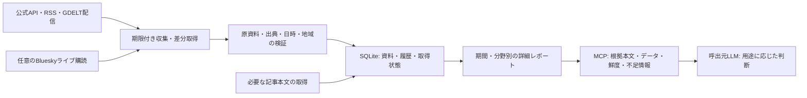

# グローバル・インテリジェンスの速報収集と詳細根拠提供 設計書

作成日: 2026-09-22 JST。状態: 実装前の設計案。対象: `ikenokazuki/Sora`、確認済み基点 `a6ecb7c`。

## 1. 目的と利用者

SoraのMCPを呼び出すLLMへ、国・地域の情勢を判断するための詳細な資料を提供します。用途はSNS投稿の可否・時期・表現の判断、マーケティング、金融・事業、観光、旅行、その他の地域調査です。事実の収集・保存・分類は既存の非LLM基盤を拡張し、利用場面に応じた総合判断と文章化は呼出元LLMが行います。

ユーザーの明示条件:

- Yahooリアルタイムは本機能で使用しません。日本を指定した場合も同じです。
- 件数やリスク指標だけではなく、取得した内容を詳細かつ丁寧に返します。
- GDELTとGDACSを復旧し、速報とライブ情報の取得可能性を確認します。
- 国名・検索語の個別ハードコードで症状を回避しません。
- 既存のX検索など、別機能の振る舞いを変更しません。

設計上の前提:

- 地域情勢とSNS上の観測は区別します。SNSがなくても公式発表や報道を使った投稿判断の材料は提供できます。
- 秒単位の全世界ニュース網羅、すべてのSNSの検索、取引所のリアルタイム価格は、この無認証構成では保証できません。
- 「広範」は、収集対象分野・地域・言語・根拠の多様性で評価します。全分野に必ずデータがあるという意味ではありません。

## 2. 確認した現状

`git fetch ghostfetch --prune` 後、ローカルmainとremote mainは `a6ecb7c` で一致しました。リモートブランチ一覧も確認済みです。`research/evidence-compiler-v1` は研究ブランチとして扱い、製品実装に自動統合しません。

| 場所 | 問題 | 修正方向 |
|---|---|---|
| `providers/gdacs.ts` | 実データの`url`はオブジェクト、fixtureは文字列。`affectedcountries`、`severitydata`未対応 | 実レスポンスに基づくAPI/RSS/GeoJSONパーサー |
| `providers/gdelt_events.ts` | 現行の`/api/v2/events/events`は404 | 公式Events/Mentions配信の取込 |
| `report.ts` | 固定`nowDate`を経過時間計測にも渡し、`latencyMs`が0になる | レポート基準時刻と実行時計の分離 |
| `providers/worldbank.ts` | 固定2015:2025、最新GDPだけ返す。年度・単位・出典・履歴を落とす | 複数指標と出典付き時系列 |
| `providers/nager.ts` | `calendar`のみで`evidence`を生成しない | 祝日の出典・適用地域・対象年を保持 |
| `context.ts` | 要約が件数の定型文。取得済み統計・祝日のcoverageが不足扱い | 根拠と型別カバレッジによる評価 |
| `runtime.ts` | Webアダプターが標準構成に未接続 | 国際報道・公式フィードと記事本文を接続 |
| `providers/official_web.ts` | `searchYahooWeb`に結合。候補を情報本文から除外。深掘りが記事URLでなくトップページ | プロバイダー非依存の探索、未検証根拠保持、記事URLの取得 |
| `event_extract.ts` | 英語・日本語の正規表現中心、場所と対象も限定的 | 構造化情報優先。未分類の多言語本文を落とさない |
| `intelligence/domains/*` | 健康・カレンダー等が空配列固定、信号の振分けのみ | 各用途の具体的材料・不足情報・根拠参照 |
| `mcp.ts` | `includeSocial`説明がYahoo専用。テキストJSONだけ返す | 新スキーマ、構造化出力、詳細・更新取得ツール |

前回の再現試験ではGDACSの95件に中国が被災国として含まれる19件がありました。実形式への検証用変換後は19件を処理できました。GDELTの最新ZIPは1,457レコードで、中国を発生地とする76レコードを確認しました。いずれも30日分の完全な取得を意味しません。

SQLiteも読み取り専用で検査しました。稼働コンテナは`./data/sora.db`を使用、`PRAGMA quick_check=ok`、WAL有効、レポート1件を確認しました。この時点で内部DBへの接続不能は再現していません。ただし実パスは`/app/data/sora.db`で、マウント先`/data`の外です。コンテナ再作成で履歴を失う構成を確認しました。既存DBを整合した状態でバックアップしてから`SORA_DB_PATH=/data/sora.db`へ移行します。外部のGDELT/GDACS接続問題と内部SQLiteの永続化問題を区別します。

## 3. 実測した速報・ライブ経路

詳細な時刻、URL、HTTP状態、件数は計画書横の`2026-09-22-global-intelligence-live-evidence.evidence.json`を参照してください。主試験は同一ホストのBunと稼働中web-fetcherコンテナのBunから実行しました。1経路1回ずつの観測であり、可用性SLAや平均・p95ではありません。

| 経路 | ホスト | コンテナ | 確認した内容 |
|---|---|---|---|
| USGS過去1時間GeoJSON | 200 / 334ms | 200 / 341ms | 3件。再取得で配信生成時刻の更新を確認 |
| GDELT更新一覧 | 200 / 196ms | 200 / 203ms | Events配信URLを取得。ファイル名時刻は未来のため鮮度判断に単独使用しない |
| GDACS RSS | 200 / 4,183ms | 200 / 3,211ms | 414件。直近の配信項目時刻は18:15:03 UTC |
| NASA EONET | 200 / 1,089ms | 200 / 1,021ms | 指定上限5件。観測日時は公開日時ではない |
| BBC World RSS | 200 / 75ms | 200 / 59ms | 32件。最新の解析可能な項目日付17:48:23 UTC |
| UN News RSS | 200 / 46ms | 200 / 12ms | 30件。報道・人道情報の本文へのリンク |
| ECB発表RSS | 200 / 761ms | 200 / 540ms | 15件。政策・金融関連の公式資料 |
| WHO News RSS | 200 / 331ms | 200 / 62ms | 25件。ただし最新解析日付は2026-02-25。速報源として採用不可 |
| GDELT DOC（China / 24h） | 429 / 12,235ms | 200 / 15,608ms | コンテナで10件。HTTP成功でも最新seen時刻は13:00 UTCで、遅延の評価が別途必要 |
| Bluesky Jetstream v2 | 投稿関連イベント5件 | 投稿関連イベント5件 | 初回イベント455ms / 381ms。接続中に発生したイベントを確認 |

補足試験:

- USGS配信生成時刻は18:24:48→18:26:23 UTCに進みました。地震イベント自体の追加は未確認です。
- DWドイツ語RSS: 200、88項目。France24フランス語RSS: 403。
- WHO Disease Outbreak Newsページ: 今回の直接取得は403。健康分野の完全な速報対応は未確認です。
- Bluesky公開検索API: 今回は403。ライブストリーム成功を「自由な国別過去検索の成功」と扱いません。
- BBCの記事1件は6,079文字・36段落、UNの記事1件は3,026文字・15段落をReadabilityで抽出できました。全記事の全文取得や再配布の許諾を保証する結果ではありません。
- EONETはJSON本文に対して`application/rss+xml`ヘッダーを返しました。Content-Typeだけに依存しない限定的な形式判定が必要です。

公式上の配信特性:

- [USGS](https://earthquake.usgs.gov/earthquakes/feed/v1.0/geojson.php): フィードを毎分更新。発生から観測・公表までの時間は別です。
- [GDELT](https://gdeltproject.org/data.html): Events/GKGは15分単位の配信。既存DOC APIも併用できます。
- [GDACS](https://www.gdacs.org/gdacsapi/swagger/index.html): APIに検索・ページングが存在します。RSSは同じ提供元の別経路であり、独立した裏付け情報ではありません。
- [Bluesky Jetstream v2](https://bsky.network/docs/jetstream/): 無認証のライブ購読、アカウント・コレクション絞込み、再開カーソルを提供します。国別フィルターは提供しません。
- [ECB](https://www.ecb.europa.eu/home/html/rss.en.html): 発表・声明・統計等を配信します。株価のティック配信ではありません。

## 4. アーキテクチャの選択

候補Aは毎回全データ源を同期検索する構成です。実装量は少ない一方、外部遅延と429がMCP応答へ直結し、30日履歴も確保できません。

候補Bは定期収集・永続保存を基本とし、要求時に期限内の追加更新を行う構成です。履歴と速報の両方を扱え、部分障害でも根拠を返せます。これを推奨します。

候補Cは外部の有料ニュース・市場・SNS APIに依存する構成です。契約対象領域の充実には有効ですが、現在の認証情報・利用権限を未確認のため必須依存にしません。

Bun・SQLite・既存`fast-xml-parser`・Readability・スクレイパーを再利用します。Kafka、Redis、ベクトルDB、新しいLLM依存は追加しません。記事取得は既存の公開URL検査と取得経路を使用します。

## 5. 返却契約

既存の`CountryContextReport`、`situation`、`evidence`、`domains`、`signals`を削除・改名せず、詳細情報を加算します。新しいレポートに`schemaVersion: "2"`を付与し、過去の保存レポートは旧形式として読み出せるようにします。

### 5.1 入力

既存入力を維持し、次を追加します。

| フィールド | 規定値・意味 |
|---|---|
| `period` | `1h / 24h / 7d / 30d / 90d`、規定30d。既存値を継続受付 |
| `domains` | `general / content / marketing / finance / tourism / travel`の配列。未指定は全分野 |
| `languages` | 希望言語コード配列。原文は維持し、言語を国籍判定に使わない |
| `regionCode` | 任意ISO2ヒント。既知のregionと矛盾すれば入力エラー。曖昧な国名の自動推測をしない |
| `detailLevel` | `standard / detailed`、規定`detailed`。`verbose`は診断情報の有無に使用 |
| `freshness` | `cached / refresh`、規定`refresh`。`noCache:true`は更新要求として引き続き有効 |
| `maxWaitMs` | 1,000～30,000、規定20,000。プロバイダーのレート制限は回避しない |
| `includeSocial` | 規定false。true時は構成済みの国際SNS源のみ使用。なければ明示的な不足情報 |

`query:""`、`topics:[""]`の正規化を維持します。MCPとRESTで同一スキーマを使用します。`topics`の文字列をAND条件で1クエリに全部連結せず、分野別に計画します。

### 5.2 詳細レポート

追加する主な構造:

- `requestedWindow` / `actualWindows`: 要求期間、データ源ごとの取得期間、欠測範囲、速報/履歴/将来予定の区分。
- `briefing[]`: 分野別の具体的な見出し、出典の説明・抜粋、根拠ID、確認日時。件数だけで済ませません。
- `observations[]`: 出典が示す出来事・統計・公式発表の詳細。分類できない資料も`unclassified`として保持します。
- `domainContext`: 各分野の`factors[]`、`evidenceIds[]`、`missingInformation[]`。同じ根拠を複数用途で参照できます。
- `freshness`: 最終更新確認、保存資料の取得時刻、配信側の更新時刻、キャッシュ利用、遅延・不明・時刻異常。
- `limitations[]`: 情報不足の具体的理由。`not_configured / rate_limited / blocked / timeout / parse_error / stale / unknown_geography / period_gap / detail_unavailable / classification_unsupported`等。
- `evidencePage`: 返却済み件数、保存件数、次ページカーソル、詳細取得方法。取得時の上限到達も`acquisitionTruncated`として別表示します。
- `refreshState`: `complete / partial / pending`と取得作業ID。`complete`は作業の完了であり世界情勢の網羅ではありません。

各根拠には既存フィールドに加えて、`providerId`、`providerItemId`、`sourceRecordUrl`、`originalLanguage`、`contentKind`、`originalText`または取得可能な文章ブロック、`contentTruncated`、`updatedAt`、`occurredAt`、`validFrom`、`validUntil`、`timeBasis`、`sourceStatus`、`geographyBasis`を保持します。不明値を現在日時や要求国で補完しません。

`contentKind`は`title_only / excerpt / extracted_text / structured_record`を区別します。記事全文を取得できなければ`excerpt`と理由を返します。APIが記事本文を返さない場合は当該記事URLを取得します。配信元の利用条件に応じて全文保存・出力の可否をsource設定で制御します。

事実文の由来は`provider_field / source_excerpt / rule_derived`で区別します。非LLM実装で自由な文章を創作せず、原文抜粋と型付きフィールドから構成します。曖昧な否定・対象・時刻を正規表現だけで確定しません。正確な抽出ができない場合も資料自体をLLMに渡します。

### 5.3 用途別の広がり

| 用途 | 必要な資料 | 返却時の不足情報例 |
|---|---|---|
| SNS投稿 | 災害・犠牲者への公式言及、追悼日、公式中止発表、抗議、外交問題、ブランド関連報道、祝祭・文化情報、更新や訂正 | 投稿文・対象地域・予定時刻・ブランド文脈未指定、現地反応未取得 |
| マーケティング | 祝祭日、消費・物価・雇用、催事、業界動向、物流や営業への影響、広告規制発表 | 現地語不足、対象業種不明、消費者調査未取得 |
| 金融・事業 | GDP成長、物価、雇用、人口、貿易、中央銀行・政府発表、政策・制裁、事業関連報道 | 年次統計の遅れ、市場価格未接続、未確定政策 |
| 観光 | 祭り・展示・文化行事・季節要因・祝日・施設営業案内・公式観光情報 | 施設の最新営業確認なし、都市不明 |
| 旅行 | 災害、交通障害、健康・入国・渡航情報、ストライキ、現地の現在有効な警報 | 出発国・旅程・日時不明、航空/鉄道ライブ源未接続 |
| 汎用調査 | 政治・選挙・外交・経済・治安・災害・保健・人道・文化・社会の原資料 | 特定分野だけ取得、転載のみ、複数独立ソースなし |

SNS投稿判断例では「投稿して安全」「投稿禁止」をSoraが断定しません。根拠を付けた「同地域で現在有効な災害情報がある」「直近の訂正がある」「文化行事と投稿予定日が重なる」といった材料を返し、判断に不足する条件を明示します。ニュース件数から世論や国民感情を推定しません。

### 5.4 MCPの詳細取得

既存`research_country_context`を維持し、次の3ツールを同じ`intel`カテゴリへ追加します。

1. `get_country_context(contextId)`: 保存済みの一貫したスナップショットとrefresh状態を取得。
2. `get_country_context_evidence(contextId, evidenceIds?, cursor?, limit?)`: 根拠原文・構造化データを取得。スナップショットに属さないIDは拒否。
3. `get_country_context_updates(contextId, cursor?)`: 前回以降の追加・更新・訂正・削除・欠測・取得障害を返す。通常のMCP tool callで差分を取得し、SSE配信の導入を必須にしません。

`structuredContent`とその`outputSchema`を付け、既存クライアント向けに同内容のJSONをtextにも返します。二重の文章要約は追加しません。`default.`互換エイリアス、遅延公開、`search_tools`の有効化を維持します。[MCPの構造化ツール出力](https://github.com/modelcontextprotocol/modelcontextprotocol/blob/main/docs/specification/2025-06-18/server/tools.mdx)

初回応答は詳細モードで最大40件の根拠、本文は1件4,000文字を目安とし、応答JSONは128KiBを目標上限にします。全保存資料はページ取得可能にします。上限で削った場合は必ず件数と続きを表示し、重要な根拠を消して短い応答を作りません。断片化した本文は根拠内のブロック番号で継続取得します。

## 6. 収集・鮮度・履歴

推奨の初期運用値（測定済みSLAではありません）:

| 経路 | 収集間隔 | 1回の期限 | 更新確認が古いとみなす目安 |
|---|---:|---:|---:|
| USGS速報 | 60秒 | 8秒 | 3分 |
| GDACS RSS | 5分 | 15秒 | 20分 |
| GDELT Events更新一覧 | 5分、同一ファイルは再取得しない | 10秒、ZIPは30秒 | 45分 |
| GDELT DOC | 要求時/監視対象のみ、ホスト全体で6秒以上の間隔 | 25秒 | 30分（取得確認）。記事年齢は別項目 |
| 報道RSS・公式速報 | 5分、提供側指定があれば優先 | 10秒 | 取得確認15分 |
| EONET | 15分 | 10秒 | 取得確認1時間 |
| World Bank・祝日 | 24時間 | 10秒 | 取得確認48時間。統計の対象年は別管理 |
| Bluesky（有効時） | 接続中の購読 | 無通信30秒で状態再検査 | 接続状態と受信遅延で判定 |

- `retrievedAt`は取得した時刻、`lastCheckedAt`は304を含む確認時刻。304で資料の公表時刻を書き換えません。
- 新しい公表がない状態と、データ配信が停止した状態は区別します。低頻度公式発表を古い記事1件だけで障害判定しません。
- GDELTのファイル名時刻、DOCのseen時刻、USGSの発生/改訂、GDACSの発生/終了/更新、統計の対象年を個別に解釈します。観測時刻に未来値があれば`clock_anomaly`。将来の祝日や予定行事は異常としません。
- 429は`Retry-After`を優先し、欠落時は30秒から最大5分へ待機を伸ばします。無限リトライ、IP切替、アクセス制御の迂回はしません。
- 同一sourceへの同時取得は1本、全HTTP並列4、記事本文並列2。通信期限を超えた際は保存済み資料と不足情報を返します。
- 地理はISO対応表・提供側の被災国配列・検証済み境界データを利用します。座標しかないデータは国を断定せず、正式に導入した境界データの版と照合結果を記録します。
- ライブ期間（1h/24h）とは別に、発生が古くても現在有効な災害・渡航情報を`ongoingContext`で返します。将来の祝日・予定は`upcomingCalendar`で返します。
- GDELTの初回30/90日取込はバックグラウンドで行い、取り込めた区間だけを完了扱いにします。各ファイルの取得状態を保持し、欠測を埋めるまで`period_gap`を表示します。

## 7. データ源の役割と代替

基本構成はGDELT DOC/Events、GDACS RSS/API、USGS、EONET、国際/現地報道RSS、公式機関の資料、World Bank、カレンダーです。BBC・UN・ECB・DWは接続検証例であり、これらだけで全世界・全分野をカバーした扱いにはしません。

公式/現地sourceは`source_registry`へ、提供元、URL、地域、言語、分野、確認根拠、更新間隔、資料の利用条件をデータとして登録します。国コードごとの分岐をコードに書きません。候補sourceは未検証ラベル付きの根拠として残し、HTTP200やドメイン末尾だけで「公式」に昇格させません。

[ReliefWeb](https://apidoc.reliefweb.int/)は人道・災害の詳細資料、[ACLED](https://acleddata.com/api-documentation/getting-started)は抗議・政治暴力の補完候補です。前者は承認済みappname、後者は認証が必要です。未設定時に無言で空配列にせず`not_configured`を返します。本実装の初回リリース条件にはしません。

Blueskyは任意の補助sourceとして導入可能です。まず検証済みの機関アカウント等に購読範囲を限定します。全球の全投稿を無制限保存しません。言語・投稿者プロフィールから国民の所属や現地世論を決めません。投稿本文の地域言及も`mentioned_region`であり、発生地とは別です。更新・削除と再接続時の欠落範囲を処理します。

## 8. 完了条件

- Yahooリアルタイムへの呼出しがインテリジェンス経路で0件。既存の独立したX検索テストは成功すること。
- 実レスポンスのfixtureでGDACS URL形式、複数被災国、日時、出典が正しく復元されること。
- GDELTの404経路を排除し、部分履歴を完全履歴と誤表示しないこと。
- 見出し・本文抜粋・統計系列・祝日が出典と結び付き、分類不能でも失われないこと。
- MCP初回応答からLLMが具体的根拠を読めること。追加ページと差分がMCPから取得できること。
- 各用途の不足情報が明示され、取得0件を「問題なし」と扱わないこと。
- 429、10秒超の正常応答、古いfeed、未来の観測日時、Content-Type不一致、部分成功、SQLite停止・ディスク不足を回帰試験に含めること。
- 稼働コンテナからのライブ試験に成功し、通信成功と内容の鮮度を別々に報告すること。

実装順序・ファイル・テスト手順は[実装計画](../plans/2026-09-22-global-intelligence-live-evidence.md)を参照してください。
